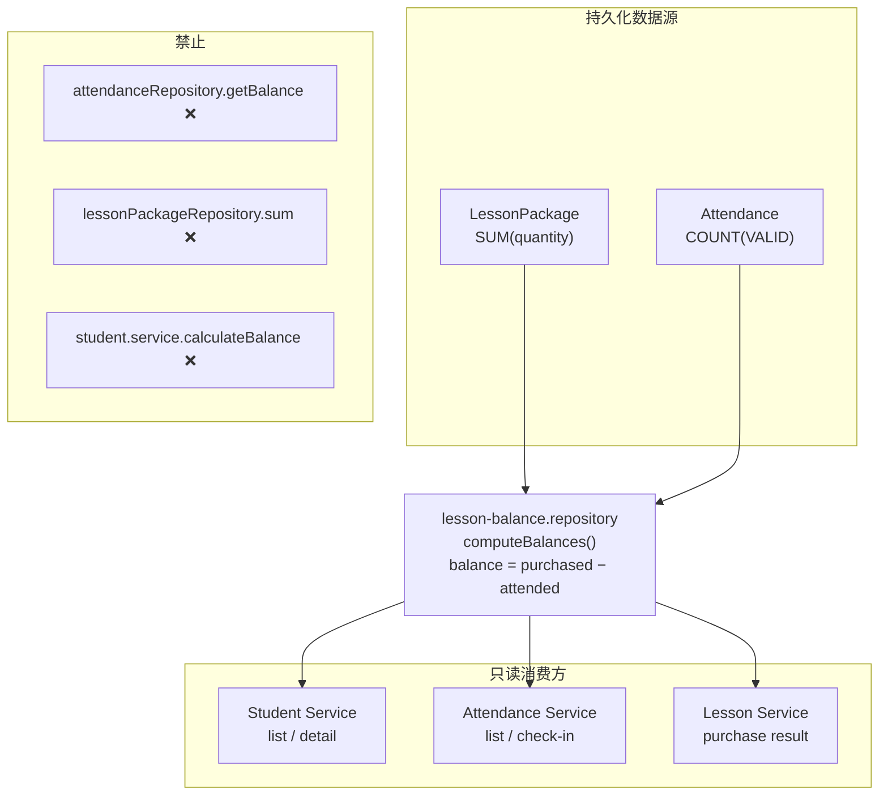

# Sprint 4 Review Evidence

> **用途**：Sprint 4 最终 Review 可复核证据  
> **日期**：2026-07-01  
> **Review 结论**：✅ **APPROVED** — Sprint 4 **CLOSED**  
> **测试脚本**：`scripts/m4-attendance-acceptance.test.mts`  
> **命令**：`npm run test:m4-attendance`  
> **前置**：PostgreSQL（`npx prisma dev start default`）已启动

---

## Evidence 1 — Attendance Acceptance（Spec §5.3）

每条场景均通过 **真实 PostgreSQL** + **Action 层入口** 执行。

**测试锚点**：`scripts/m4-attendance-acceptance.test.mts` 内注释 `// §5.3 #N`（不依赖行号，import 变更后仍稳定）。

### Scenario 1 — 首次签到成功

| 项 | 内容 |
|----|------|
| **Spec** | Given 小明在读、余额 8、今日未签 → When 签到 → Then 已签到，余额 7 |
| **Setup** | `createStudentAction` + `createLessonPurchaseAction(quantity: 8)` |
| **When** | `checkInStudentAction({ studentId, attendanceDate: TODAY })` |
| **Then 断言** | |
| | `listTodayAttendanceAction` 签到前：`lessonBalance === 8`，`todayStatus === NOT_CHECKED_IN`，`canCheckIn === true` |
| | `checkInStudentAction`：`success === true`，`data.lessonBalance === 7`，`data.todayStatus === CHECKED_IN` |
| | `prisma.attendance.count({ status: VALID }) === 1` |
| **测试锚点** | `// §5.3 #1` |

---

### Scenario 2 — 当日重复签到

| 项 | 内容 |
|----|------|
| **Spec** | Given 小明今日已签 → When 再签 → Then ALREADY_CHECKED_IN，余额不变 |
| **Given** | Scenario 1 后小明已签到 |
| **When** | `checkInStudentAction({ studentId: xiaomingId, attendanceDate: TODAY })` |
| **Then 断言** | |
| | `success === false`，`errorType === ALREADY_CHECKED_IN` |
| | `listTodayAttendanceAction`：`lessonBalance === 7`，`todayStatus === CHECKED_IN` |
| | `Attendance.count(VALID) === 1`（无第二条记录） |
| **测试锚点** | `// §5.3 #2` |

---

### Scenario 3 — 余额不足签到失败

| 项 | 内容 |
|----|------|
| **Spec** | Given 小红余额 0 → When 签到 → Then INSUFFICIENT_BALANCE，无记录 |
| **Given** | `createStudentAction`（无购课，`lessonBalance === 0`） |
| **When** | `checkInStudentAction({ studentId: xiaohongId })` |
| **Then 断言** | |
| | `success === false`，`errorType === INSUFFICIENT_BALANCE` |
| | `Attendance.count(VALID) === 0` |
| | `listTodayAttendanceAction`：`lessonBalance === 0`，`canCheckIn === false` |
| **测试锚点** | `// §5.3 #3` |

---

### Scenario 4 — 多学员连续签到

| 项 | 内容 |
|----|------|
| **Spec** | Given 5 名学员均可签 → When 依次签到 → Then 5 人均已签到 |
| **Given** | 5 名学员各 `createLessonPurchaseAction(quantity: 3)` |
| **When** | 循环 `checkInStudentAction` × 5 |
| **Then 断言** | |
| | 每次 `success === true` |
| | `listTodayAttendanceAction`：5 人 `todayStatus === CHECKED_IN`，`lessonBalance === 2`，`canCheckIn === false` |
| **测试锚点** | `// §5.3 #4` |

---

### Scenario 5 — 未到课学员

| 项 | 内容 |
|----|------|
| **Spec** | Given 小刚未到课 → When 不操作 → Then 未签到，余额不变 |
| **Given** | `createLessonPurchaseAction(quantity: 5)`，**不调用** checkIn |
| **When** | （无操作） |
| **Then 断言** | |
| | `listTodayAttendanceAction`：`todayStatus === NOT_CHECKED_IN`，`lessonBalance === 5` |
| | `Attendance.count(VALID) === 0` |
| **测试锚点** | `// §5.3 #5` |

---

### Scenario 6 — 最后一节课签到

| 项 | 内容 |
|----|------|
| **Spec** | Given 余额 1 → When 签到 → Then 成功，余额 0，不可再签 |
| **Given** | `createLessonPurchaseAction(quantity: 1)` |
| **When** | `checkInStudentAction` → 再 `checkInStudentAction` |
| **Then 断言** | |
| | 首次：`success === true`，`data.lessonBalance === 0` |
| | 二次：`success === false`，`errorType === ALREADY_CHECKED_IN` 或 `INSUFFICIENT_BALANCE` |
| | `listTodayAttendanceAction`：`lessonBalance === 0`，`canCheckIn === false` |
| **测试锚点** | `// §5.3 #6` |

---

### Scenario 7 — Students 页面余额同步

| 项 | 内容 |
|----|------|
| **Spec** | Given 小明刚签到 → When 查 `/students` 数据 → Then 余额与今日名单一致 |
| **Given** | Scenario 1 后小明 `lessonBalance === 7` |
| **When** | `listStudentsAction()` + `listTodayAttendanceAction()` + `getStudentAction(xiaomingId)` |
| **Then 断言** | |
| | `listStudentsAction.data[xiaoming].lessonBalance === listTodayAttendanceAction.data[xiaoming].lessonBalance` |
| | `getStudentAction.data.lessonBalance === 7` |
| **测试锚点** | `// §5.3 #7` |

---

### Scenario 8 — 已归档学员签到失败

| 项 | 内容 |
|----|------|
| **Spec** | Given 已归档学员 → When 尝试签到 → Then STUDENT_ARCHIVED，无记录 |
| **Given** | `prisma.student.create({ status: ARCHIVED })` |
| **When** | `checkInStudentAction({ studentId: archived.id })` |
| **Then 断言** | |
| | `success === false`，`errorType === STUDENT_ARCHIVED` |
| | `Attendance.count(VALID) === 0` |
| **测试锚点** | `// §5.3 #8` |

---

### 附加场景（非 §5.3 主表，同脚本可复核）

| 场景 | When | Then | 测试锚点 |
|------|------|------|----------|
| STUDENT_NOT_FOUND | `checkInStudentAction({ studentId: "nonexistent-cuid-id" })` | `errorType === STUDENT_NOT_FOUND` | `// 附加 STUDENT_NOT_FOUND` |
| 3 已签 / 1 未签 | 3 人签到，1 人不签 | 3×`CHECKED_IN`+balance 3；1×`NOT_CHECKED_IN`+balance 4 | `// 附加 3 已签 / 1 未签` |
| 1 记录 = 1 扣课 | 购课 10 → 签到 1 次 | `count(VALID)===1`，`lessonBalance===9` | `// 附加 1 记录 −1 余额` |

---

## Evidence 2 — Student Module Zero Change

### 2.1 Static Audit Result

| 文件 / 层 | 结论 |
|-----------|------|
| `student.service.ts` | **No business logic change** |
| `student.actions` | **No change** |
| `student.mapper` | **No change** |
| `student.repository` | **No change** |
| `student.validators` | **No change** |
| `student-list.tsx` / `student-detail-view.tsx` / `create-student-form.tsx` | **No change** |
| `students-page.tsx` | 仅新增导航 `<Link href="/attendance">`（UI，非业务层） |

### 2.2 Sprint 4 对 `src/features/students/` 的变更清单

| 文件 | Sprint 4 是否修改 | 说明 |
|------|-------------------|------|
| `services/student.service.ts` | **否** | 无 diff；逻辑与 Sprint 3 M2 APPROVED 一致 |
| `actions/*.action.ts` | **否** | 3 个 Action 文件无 attendance 引用 |
| `mappers/student.mapper.ts` | **否** | 无 attendance 引用 |
| `repositories/student.repository.ts` | **否** | 无 attendance 引用 |
| `validators/**` | **否** | 无变更 |
| `types/**` | **否** | 无变更 |
| `components/student-list.tsx` | **否** | 无变更 |
| `components/student-detail-view.tsx` | **否** | 无变更 |
| `components/create-student-form.tsx` | **否** | 无变更 |
| `components/students-page.tsx` | **是（仅 UI 导航）** | 新增 `<Link href="/attendance">今日签到</Link>`；**无** Action/Service/Repository 变更 |

### 2.3 `student.service.ts` — 无 Sprint 4 业务变更

Sprint 3 M2 已接入 `lessonBalanceRepository`（见 `.agent/SPRINT3_PROGRESS_M2.md` §2）。Sprint 4 **未再修改**该文件。

当前调用链（与 Sprint 3 一致）：

```
listActiveStudents:
  studentRepository.findAllActive()
  → lessonBalanceRepository.getBalances(ids)
  → toSummaryList()

getStudentDetail:
  studentRepository.findById(id)
  → lessonBalanceRepository.getBalance(id)
  → toDetail()

createStudent:
  studentRepository.create(...)
  → toDetail(entity, 0)   // 新建学员余额恒为 0
```

### 2.4 静态 grep 审计（2026-07-01）

```
src/features/students/services/     → attendance: 0 matches
src/features/students/actions/      → attendance: 0 matches
src/features/students/mappers/      → attendance: 0 matches
src/features/students/repositories/ → attendance: 0 matches
```

唯一 attendance 相关：`students-page.tsx` 第 125 行导航链接 `href="/attendance"`。

### 2.5 运行时佐证

`test:m2-attendance` 内含：

```
✓ student list balance after check-in (student.service unchanged)
✓ getStudentAction balance after check-in
```

签到后 Student List/Detail 余额自动更新，**无需修改** `student.service`。

---

## Evidence 3 — Balance Repository 唯一余额来源（ADR-007）

### 3.0 Architecture Diagram



### 3.1 公式唯一实现点

文件：`src/features/lessons/repositories/lesson-balance.repository.ts`

```typescript
// computeBalances — 唯一聚合入口（L15–48）
balance = SUM(LessonPackage.quantity) − COUNT(Attendance WHERE status = VALID)
```

`computeBalances` 为 **非导出** 内部函数；外部仅暴露 `getBalance` / `getBalances`。

### 3.2 Student List 调用链

```
listStudentsAction()
  → studentService.listActiveStudents()
      → studentRepository.findAllActive()
      → lessonBalanceRepository.getBalances(ids)    ← 余额唯一来源
      → student.mapper.toSummaryList(entities, balanceMap)
```

源码：`student.service.ts` L22–28

### 3.3 Student Detail 调用链

```
getStudentAction(id)
  → studentService.getStudentDetail(id)
      → studentRepository.findById(id)
      → lessonBalanceRepository.getBalance(id)      ← 余额唯一来源
      → student.mapper.toDetail(entity, lessonBalance)
```

源码：`student.service.ts` L52–63

### 3.4 Attendance Today List 调用链

```
listTodayAttendanceAction()
  → attendanceService.listTodayAttendance()
      → studentRepository.findAllActive()
      → attendanceRepository.getTodayStatuses(ids, date)   // 仅今日状态，非余额
      → lessonBalanceRepository.getBalances(ids)         ← 余额唯一来源
      → attendance.mapper.toTodayRowList(...)
```

源码：`attendance.service.ts` L44–55

### 3.5 Attendance Check In 调用链

```
checkInStudentAction({ studentId })
  → attendanceService.checkInStudent()
      → studentRepository.findById()
      → attendanceRepository.existsToday()           // 仅重复检查
      → lessonBalanceRepository.getBalance()        ← 签到前余额校验
      → attendanceRepository.create()              ← 写入 VALID 记录
      → lessonBalanceRepository.getBalance()        ← 签到后余额（公式自动 −1）
      → attendance.mapper.toCheckInResult()
```

源码：`attendance.service.ts` L81–128

扣课**不写入** `LessonPackage`；余额减少由 `computeBalances` 中 Attendance COUNT 增加体现。

### 3.6 禁止项静态审计（全 `src/` grep，2026-07-01）

| 禁止模式 | 结果 |
|----------|------|
| `attendanceRepository.getBalance()` | **不存在** |
| `attendanceRepository.getBalances()` | **不存在** |
| `lessonPackageRepository` 在 Service 层做 sum/余额 | **仅** `lesson.service.create` 写入购课；**无**余额计算 |
| `student.service.calculateBalance()` | **不存在** |
| `getBalance` / `getBalances` 定义处 | **仅** `lesson-balance.repository.ts` |
| `getBalance` / `getBalances` 调用处 | `student.service.ts`、`attendance.service.ts`、`lesson.service.ts`（购课后读余额） |

`attendance.repository.ts` 方法集：`create` · `existsToday` · `getTodayStatuses` — **无余额方法**（`test:m1-attendance` 断言 ✅）。

---

## Evidence 4 — UI 静态 Import 审计

### 4.1 `src/app/attendance/page.tsx`（Server Route）

| Import | 分类 |
|--------|------|
| `listTodayAttendanceAction` | ✅ Action |
| `AttendancePage` | ✅ Feature Component |
| Service / Repository / Prisma | ❌ 无 |

### 4.2 `attendance-page.tsx`（Client Container）

| Import | 分类 |
|--------|------|
| `next/link` | ✅ 导航 |
| `react` (`useCallback`, `useState`) | ✅ UI 状态 |
| `checkInStudentAction` | ✅ Action |
| `listTodayAttendanceAction` | ✅ Action |
| `AttendanceTodayList` | ✅ 子组件 |
| `AttendanceTodayRow` (type) | ✅ ViewModel 类型 |
| `attendanceService` | ❌ 无 |
| `*repository*` | ❌ 无 |
| `prisma` / `@/shared/lib/db` | ❌ 无 |

### 4.3 `attendance-today-list.tsx`

| Import | 分类 |
|--------|------|
| `AttendanceTodayRow` (component) | ✅ 子组件 |
| `AttendanceTodayRow` (type) | ✅ ViewModel |
| `@/shared/components/ui/table` | ✅ 展示 |
| Action / Service / Repository / Prisma | ❌ 无 |

业务逻辑审计：`lessonBalance` 仅作表格展示，**无** `lessonBalance <` / `>` 比较表达式。

### 4.4 `attendance-today-row.tsx`

| Import | 分类 |
|--------|------|
| `AttendanceTodayRow` (type) | ✅ ViewModel |
| `Button`, `TableCell`, `TableRow` | ✅ 展示 |
| Action / Service / Repository / Prisma | ❌ 无 |

业务状态：直接读取 `row.canCheckIn`、`row.todayStatus`、`row.lessonBalance`；**不**自行计算是否可签。

### 4.5 自动化审计（`m4-attendance-acceptance.test.mts` L69–103）

`assertUiLayerCompliance()` 在每次 M4 验收运行时执行：

- `attendance-page.tsx` 含 Action import，**不含** Service/Repository import
- `attendance-today-row.tsx` **不含** Action/Service/Repository import
- `attendance-today-list.tsx` **不含** Action import，**不含** balance 比较逻辑

最近一次运行：**✓ UI layer compliance audit**（2026-07-01）

---

## Evidence 5 — 全量回归范围与结果

### 5.1 执行时间

**2026-07-01 11:42:32**（本地，Prisma Dev `default` 已启动）

### 5.2 命令清单

| 模块 | 命令 | 层级 | 结果 |
|------|------|------|------|
| **Attendance** | `npm run test:m4-attendance` | Acceptance（§5.3 八条 + 附加） | ✅ All Passed |
| **Attendance** | `npm run test:m1-attendance` | Repository | ✅ All Passed |
| **Attendance** | `npm run test:m2-attendance` | Service + Action | ✅ All Passed |
| **Lesson** | `npm run test:m4-lesson` | Acceptance | ✅ All Passed |
| **Lesson** | `npm run test:m1-lesson` | Repository | ✅ All Passed |
| **Lesson** | `npm run test:m2-lesson` | Service + Action | ✅ All Passed |
| **Student** | `npm run test:m4` | Acceptance | ✅ All Passed |
| **Student** | `npm run test:m1` | Repository | ✅ All Passed |
| **Student** | `npm run test:m2` | Service | ✅ All Passed |
| **Build** | `npm run build` | UI + TypeScript | ✅ `/attendance` + `/students` 路由生成 |

### 5.3 Test Coverage Summary

| Layer | Attendance | Student | Lesson | Status |
|-------|------------|---------|--------|--------|
| Repository | `test:m1-attendance` | `test:m1` | `test:m1-lesson` | ✅ |
| Service | `test:m2-attendance` | `test:m2` | `test:m2-lesson` | ✅ |
| Action | `test:m2-attendance` | `test:m2` / `test:m4` | `test:m2-lesson` / `test:m4-lesson` | ✅ |
| Acceptance | `test:m4-attendance` | `test:m4` | `test:m4-lesson` | ✅ |
| UI Audit | `assertUiLayerCompliance()` | lesson M4 audit | — | ✅ |
| Regression | 全模块交叉 | 全模块交叉 | 全模块交叉 | ✅ |
| Build | `npm run build` | — | — | ✅ |

### 5.4 结论

```
All Passed — No Regression
```

- Student Module：M1/M2/M4 全部通过，签到后余额联动正常
- Lesson Module：M1/M2/M4 全部通过，购课与余额未受影响
- Attendance Module：M1/M2/M4 全部通过，Acceptance 八条覆盖完整

---

## Final Decision

| 项 | 结论 |
|----|------|
| **Sprint 4** | ✅ **APPROVED** |
| **Attendance Module** | ✅ **Accepted** |
| **Sprint Status** | ✅ **CLOSED** |
| **Review 日期** | 2026-07-01 |

---

## 后续 Evidence 改进建议（Tech Lead Minor Comments）

1. **测试锚点**：用 `// §5.3 #N` 或 `test("Given...When...Then")` 替代行号引用（本版已采纳锚点方式）。
2. **Student 零改动**：直接写 Static Audit Result，不依赖 Git 历史（本版已采纳）。
3. **余额架构**：用 Architecture Diagram 辅助文字说明（本版已补充 Mermaid 图）。
4. **回归摘要**：增加 Test Coverage Summary 表（本版已补充）。

下一阶段：**Sprint 5** — 继续 **Spec → Plan → ADR → Code → Evidence → Review**。
