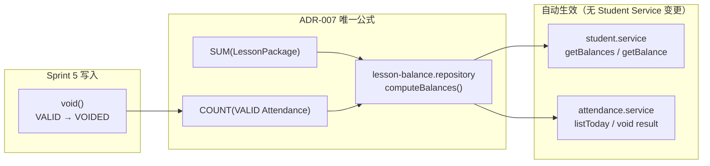
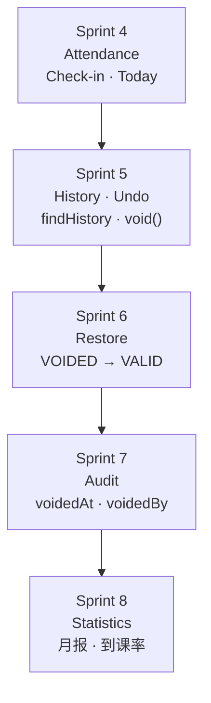
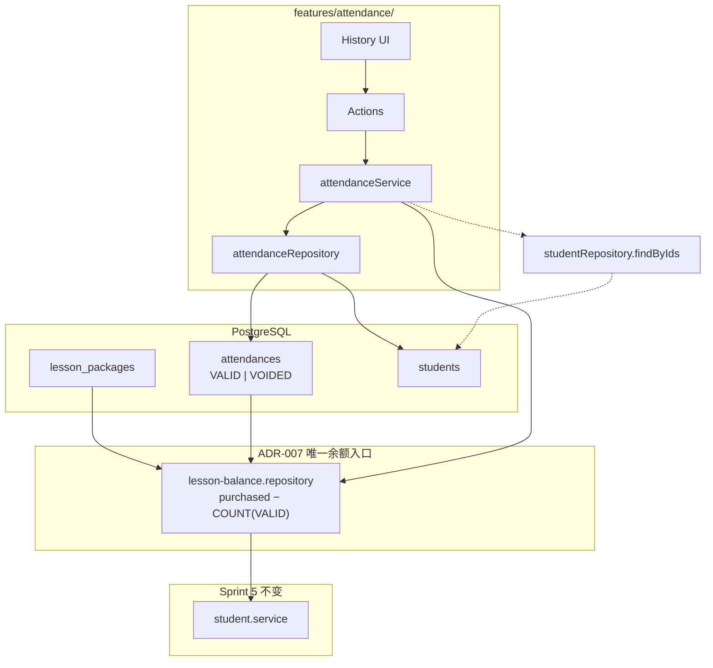

# ADR-011：Attendance History、Undo 与 VALID→VOIDED 设计


| 项   | 内容                                                |
| --- | ------------------------------------------------- |
| 状态  | 已采纳（Sprint 5 CLOSED — 2026-07-01）                 |
| 日期  | 2026-07-01                                        |
| 决策者 | Tech Lead Review                                  |
| 关联  | ADR-007 · ADR-009 · `specs/attendance-history.md` |


---

## 背景

Sprint 4 已交付快速签到与 `Attendance` 持久化（`VALID` / `VOIDED` 枚举已存在）。Phase2 需要：

1. **签到历史查询**（只读）
2. **撤销签到**（Undo）

约束：

- **不修改** Prisma Schema
- **不修改** `student.service.ts`
- **不修改** `lesson-balance.repository` 公共契约
- **不修改** Sprint 4 `checkInStudent` / `listTodayAttendance` 行为
- Sprint 2～4 已通过 Review 的设计保持兼容

---

## 决策

### 1. 为什么采用 VALID → VOIDED，而不是 DELETE


| 方案                       | 结论   |
| ------------------------ | ---- |
| **软撤销 `VALID → VOIDED`** | ✅ 采纳 |
| 物理 `DELETE`              | ❌ 否决 |


**原因**


| 原因         | 说明                                                                        |
| ---------- | ------------------------------------------------------------------------- |
| 审计追溯       | 保留「曾经签到」事实，符合工作室对账需求                                                      |
| ADR-009 预留 | Sprint 4 Schema 已含 `VOIDED`，零 Schema 成本                                   |
| 余额公式       | `COUNT(VALID)` 自动排除 VOIDED；撤销 = 余额 +1，无需写 `LessonPackage`                 |
| 未来 Audit   | 可扩展 `voidedAt` / `voidedBy` 列（Future Scope）                               |
| 唯一约束       | `@@unique([studentId, attendanceDate])` 保留单行；DELETE 后再签到可 `create`，但破坏审计链 |


**禁止**

- `DELETE FROM attendances`
- 撤销时修改 `LessonPackage.quantity`
- 撤销时写 Student 缓存余额

### 2. 为什么余额无需修改 Student Service

Sprint 3 起，`student.service` 仅调用：

```text
lessonBalanceRepository.getBalance(id)
lessonBalanceRepository.getBalances(ids)
```

Sprint 4 起，公式为：

```text
balance = SUM(LessonPackage.quantity) − COUNT(Attendance WHERE status = VALID)
```

撤销将 `VALID → VOIDED` 后：

- `COUNT(VALID)` 减 1
- `getBalance` / `getBalances` **自动**返回更高余额
- **无需**修改 `student.service.ts` 或 `student.mapper.ts`




### 3. 为什么 Sprint 4 能零成本升级


| Sprint 4 预留                      | Sprint 5 复用                                  |
| -------------------------------- | -------------------------------------------- |
| `AttendanceStatus.VOIDED` 枚举     | Undo 直接 UPDATE                               |
| `lesson-balance` 仅 COUNT `VALID` | 撤销自动恢复余额                                     |
| `existsToday` 仅查 `VALID`         | 撤销后今日显示未签                                    |
| Feature `attendance/`            | 扩展 History + Void                            |
| `ActionResult` 可扩展 errorType     | 新增 `ATTENDANCE_NOT_FOUND` / `ALREADY_VOIDED` |


**零成本**指：无 migration、无 Student/Lesson Service 变更、无 Check-in API 变更。

### 4. History 保持在 Attendance Feature


| 方案                              | 结论  |
| ------------------------------- | --- |
| 扩展 `features/attendance/`       | ✅   |
| 新建 `attendance-history` Feature | ❌   |
| 放入 `students/`                  | ❌   |


History 与 Undo 同属 `Attendance` 聚合根操作。

### 5. Repository 职责划分（RC1 — 冻结）

#### 5.1 `attendanceRepository` 完整方法集


| 方法                   | Sprint | 职责                        |
| -------------------- | ------ | ------------------------- |
| `create()`           | 4      | 写入 VALID 签到               |
| `findById()`         | 5      | 按 id 读取 Entity            |
| `findHistory(input)` | 5      | 按 `FindHistoryInput` 倒序列表 |
| `void()`             | 5      | `UPDATE status = VOIDED`  |
| `existsToday()`      | 4      | 当日 VALID 是否存在             |
| `getTodayStatuses()` | 4      | 批量当日 VALID                |


#### 5.2 Repository 负责 ✔ / 绝不 ✘


| ✔ 负责                     | ✘ 绝不         |
| ------------------------ | ------------ |
| 查询、更新、Row→Entity Mapping | 判断能否撤销       |
|                          | 判断是否已 VOIDED |
|                          | 判断余额         |
|                          | DELETE       |


#### 5.3 `findHistory` 契约（RC2 — 冻结）

```typescript
type FindHistoryInput = {
  studentId?: string
  limit?: number
  // Sprint 6+: dateFrom?, dateTo?, teacherId?, classId?, status?, cursor?
}

findHistory(input: FindHistoryInput): Promise<AttendanceEntity[]>
```

未来仅**扩展 input 字段**，不新增平行 Repository 方法。

#### 5.4 其他 Repository


| Repository                | 方法                           | 职责                            |
| ------------------------- | ---------------------------- | ----------------------------- |
| `studentRepository`       | `findByIds`                  | 批量姓名（Attendance Service only） |
| `lessonBalanceRepository` | `getBalance` / `getBalances` | **契约不变**                      |


### 6. Student Feature 如何接触历史


| 方式                                              | 允许  |
| ----------------------------------------------- | --- |
| 详情 UI → `Link` `/attendance/history?studentId=` | ✅   |
| `studentService` → `attendanceRepository`       | ❌   |
| `studentService` → `attendanceService`          | ❌   |


### 7. 查询与撤销接口

```text
listAttendanceHistoryAction(FindHistoryInput)
  → AttendanceHistoryRow[]

voidAttendanceAction({ attendanceId })
  → VoidAttendanceResult
```

### 7.1 Undo 调用链（RC3 — 冻结，不得改序）

```text
voidAttendanceAction
    ↓
attendanceService.voidAttendance
    ↓
Validator
    ↓
attendanceRepository.findById()
    ↓
不存在 → ATTENDANCE_NOT_FOUND
    ↓
status === VOIDED → ALREADY_VOIDED
    ↓
attendanceRepository.void()
    ↓
lessonBalanceRepository.getBalance()
    ↓
Mapper
    ↓
ActionResult
```

### 7.2 AttendanceHistoryRow（RC4 — 冻结字段）

`id` · `studentId` · `studentName` · `attendanceDate` · `quantityConsumed` · `status` · `checkedInAt` · `voidedAt?` · `canVoid`

Sprint 5 UI 可不展示 `quantityConsumed` / `voidedAt`（恒 `null`）；接口一次定型。

### 8. 同日撤销后再签到（边界）

DB 唯一约束 `studentId + attendanceDate` 阻止同一日第二条记录。


| 阶段                    | 行为                                    |
| --------------------- | ------------------------------------- |
| Sprint 5 Undo         | `VALID → VOIDED`；余额恢复；今日名单显示未签        |
| 同日再 `checkIn`（create） | **失败**（唯一约束）；Check-in API **不修改**     |
| Future Restore        | `VOIDED → VALID` 或 Check-in 扩展（新 ADR） |


Sprint 5 Acceptance **覆盖**撤销与余额恢复；**不覆盖**同日再签到。

### 9. Future Compatibility — Evolution（RC5）

Sprint 5 设计**不阻碍**后续演进：




| Sprint | 能力             | 对 Sprint 5 的依赖                             |
| ------ | -------------- | ------------------------------------------ |
| 5      | History + Undo | `findHistory` input · `void()` · ViewModel |
| 6      | Restore        | 同 `void()` 对称；`FindHistoryInput` 加筛选       |
| 7      | Audit          | `voidedAt` 列 + ViewModel 字段激活              |
| 8      | Statistics     | 只读聚合；不改 Service 互调                         |


**原则**：扩展 input 字段与 ViewModel 预留列，**不破坏** Repository 方法签名模式与 Undo 调用链。

### 10. 未来扩展明细


| 能力             | 设计预留                                                                  | Sprint       |
| -------------- | --------------------------------------------------------------------- | ------------ |
| **Restore**    | `restore()`：VOIDED → VALID                                            | 6            |
| **Edit**       | 修改 `attendanceDate`                                                   | Future + ADR |
| **Audit**      | `voidedAt`、`voidedBy` Schema                                          | 7            |
| **Statistics** | 只读聚合 / 月报                                                             | 8            |
| **筛选**         | `dateFrom` / `dateTo` / `teacherId` / `classId` on `FindHistoryInput` | 6+           |


### 11. 架构总图




---

## 原因


| 原因         | 说明                          |
| ---------- | --------------------------- |
| 审计         | VOIDED 保留历史                 |
| ADR-007    | 余额派生，Student Service 稳定     |
| 零迁移        | 复用 Sprint 4 Schema          |
| Feature 内聚 | History + Undo 同聚合          |
| 可扩展        | Restore / Audit / Stats 有路径 |


---

## 影响


| 模块                          | 变更                                      |
| --------------------------- | --------------------------------------- |
| `attendance.repository`     | +findHistory, +findById, +void          |
| `attendance.service`        | +listAttendanceHistory, +voidAttendance |
| `attendance` actions / UI   | 新增                                      |
| `student.repository`        | +findByIds（非 student.service 消费）        |
| `action-result.type.ts`     | 扩展 errorType                            |
| `student.service`           | **无**                                   |
| `lesson-balance.repository` | **无**                                   |
| `checkInStudent`            | **无**                                   |
| `prisma/schema`             | **无**                                   |


---

## 禁止

- DELETE 签到记录
- 修改 `student.service` / `lesson.service`
- 修改 `lesson-balance.repository` 公共签名
- 修改 Sprint 4 Check-in 调用顺序与行为
- Service 互调
- UI 直连 Repository
- Repository 内业务判断

---

## 替代方案（已否决）


| 方案                       | 否决原因                                  |
| ------------------------ | ------------------------------------- |
| DELETE 后重新签到             | 丢失审计；违背 FLOW §6 精神                    |
| 撤销时 UPDATE LessonPackage | 违背 ADR-007                            |
| Student Service 内嵌历史     | 破坏 Feature 边界                         |
| 修改 checkIn 支持 VOIDED 复活  | Sprint 5 冻结 Check-in API；归 Future ADR |


---

## 验收断言（Sprint 5 M4）


| 场景                | 期望                  |
| ----------------- | ------------------- |
| 历史倒序              | 最近在前                |
| 撤销 VALID          | status=VOIDED；余额 +1 |
| 重复撤销              | `ALREADY_VOIDED`    |
| 撤销后 Today List    | 当日未签（无 VALID）       |
| student.service   | 无 diff              |
| lesson-balance 契约 | 无 diff              |
| checkIn 回归        | Sprint 4 行为不变       |


---

## 相关文档

- `specs/attendance-history.md` Rev 3
- `specs/attendance-history.plan.md` Rev 3
- ADR-007 · ADR-009
- `.agent/SPRINT4_REVIEW_EVIDENCE.md`

