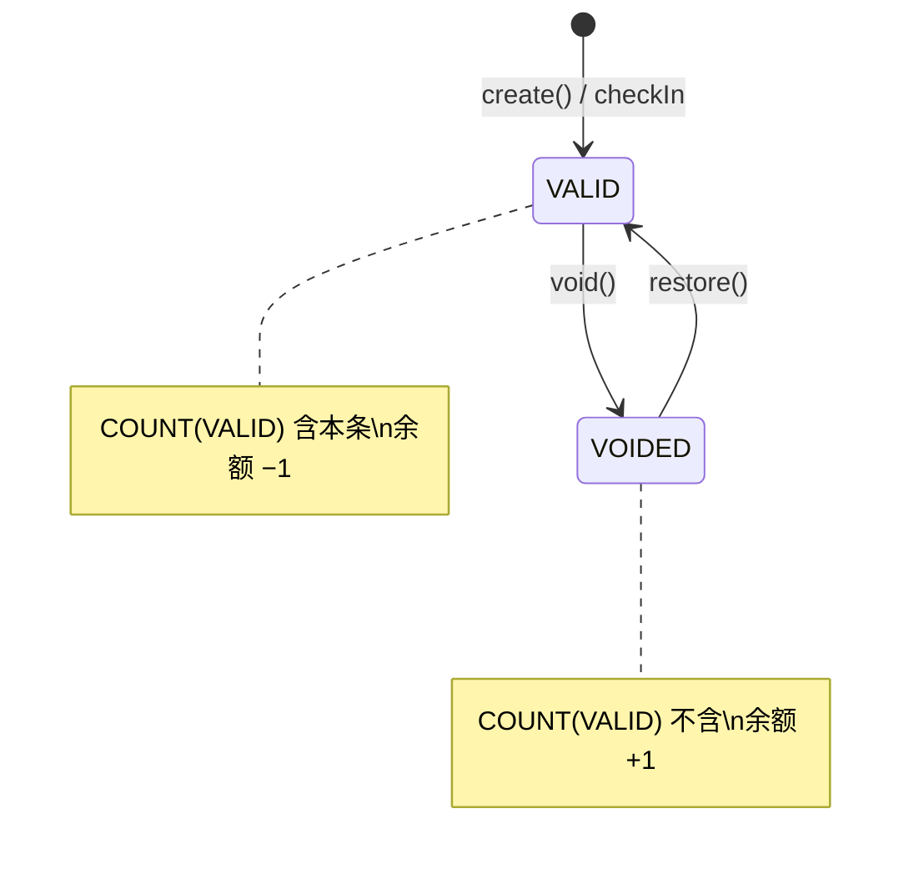

# ADR-012：Attendance Restore 与 History Filter 演进

| 项 | 内容 |
|----|------|
| 状态 | 已采纳（Sprint 6 CLOSED — 2026-07-01） |
| 日期 | 2026-07-01 |
| 决策者 | Tech Lead Review |
| 关联 | ADR-007 · ADR-011 · `specs/attendance-restore.md` Rev 2 |

---

## 背景

Sprint 5 交付 Undo（`VALID → VOIDED`）。Sprint 6 首次引入**状态逆向变更**（`VOIDED → VALID`），须冻结契约以供 Sprint 7 Audit 与 Sprint 8 Statistics 演进。

---

## 决策

### 1. Restore vs Create New Attendance

| 方案 | 结论 |
|------|------|
| `restore()`：同一行 `VOIDED → VALID` | ✅ |
| DELETE + `create()` | ❌ |
| 扩展 `checkInStudent` 复活 VOIDED | ❌ |

### 2. Restore / Void 生命周期（Non-blocking 采纳）



| 操作 | status 变更 | COUNT(VALID) | 余额 |
|------|-------------|--------------|------|
| Check-in / create | → VALID | +1 | −1 |
| void() | → VOIDED | −1 | +1 |
| restore() | → VALID | +1 | −1 |

---

### 3. Restore Rule — 余额数学（RC1 — 冻结）

```text
balance = purchased − COUNT(VALID)

Restore 前：balance_before = purchased − n
Restore 后：balance_after  = purchased − (n + 1)
```

**业务语义**：Restore **消耗 1 个剩余课时**（与 Check-in 对称）。

**Service 前置条件（冻结）**

```text
currentBalance = lessonBalanceRepository.getBalance(studentId)
currentBalance >= 1
⟺ balance_after = currentBalance − 1 >= 0
⟺ Restore 不会使余额变为负数
```

不满足 → `INSUFFICIENT_BALANCE`，**禁止**调用 `restore()`。

此规则为 Sprint 8 财务统计提供无歧义解释：**每条 VALID 记录对应 1 课时消耗**。

---

### 4. Repository `restore()` Contract（RC2 — 冻结）

```text
restore(id: string): Promise<AttendanceEntity>
```

| 字段 | restore() | void() | 说明 |
|------|-----------|--------|------|
| `status` | → `VALID` | → `VOIDED` | 唯一写入 |
| `id` | 不变 | 不变 | |
| `studentId` | 不变 | 不变 | |
| `attendanceDate` | 不变 | 不变 | |
| `createdAt` | 不变 | 不变 | `checkedInAt` 来源 |
| `voidedAt` | 见下 | 见下 | |
| `updatedAt` | N/A | N/A | Sprint 6 Schema 无列 |

#### `voidedAt` 演进（避免 Sprint 7 冲突）

| Sprint | DB | void() | restore() | ViewModel |
|--------|-----|--------|-----------|-----------|
| 5–6 | 无 `voidedAt` 列 | — | — | 恒 `null` |
| 7+ | 有 `voidedAt` 列 | SET 撤销时间 | **SET NULL** | VALID 行 `null`；VOIDED 行有值 |

**Restore 后 `voidedAt = NULL`**：记录当前处于 VALID 活跃态；撤销时间戳清除。若需保留撤销历史，由 Sprint 7 **Audit 日志表**承担，而非在 VALID 行保留 `voidedAt`。

---

### 5. `FindHistoryInput` Evolution（RC3 — 冻结）

```typescript
type FindHistoryInput = {
  studentId?: string
  dateFrom?: Date | string
  dateTo?: Date | string
  status?: AttendanceStatus
  teacherId?: string
  classId?: string
  cursor?: string
  limit?: number
}
```

| 字段 | Sprint 6 | 未来 |
|------|----------|------|
| `studentId` | ✅ | — |
| `dateFrom` / `dateTo` | ✅ | — |
| `limit` | ✅ | — |
| `status` | Reserved | 筛选 |
| `teacherId` / `classId` | Reserved | Teacher/Class Sprint |
| `cursor` | Reserved | 分页 |

**原则**：类型一次定型；Sprint 6 Validator/Repository **忽略** Reserved 字段；禁止新增平行 Repository 方法。

**时区**：`dateFrom`/`dateTo` 使用 `toAttendanceDate`（本地自然日），与 `attendanceDate` 存储一致。

---

### 6. `AttendanceHistoryRow` 最终接口（RC4 — 冻结）

```typescript
type AttendanceHistoryRow = {
  id: string
  studentId: string
  studentName: string
  attendanceDate: string
  status: AttendanceStatus
  quantityConsumed: number
  checkedInAt: string
  voidedAt: string | null
  canVoid: boolean
  canRestore: boolean
  note?: string           // Reserved
  teacherName?: string    // Reserved
  className?: string      // Reserved
}
```

Sprint 6 UI 可不展示 Reserved 字段；**接口不得再增删字段**。

---

### 7. Restore 调用链 — Architecture Freeze（RC5）

> **Sprint 6 起，以下调用链冻结；后续 Sprint 不得调整顺序，仅允许在步骤内部扩展实现。**

```text
restoreAttendanceAction
    ↓
attendanceService.restoreAttendance
    ↓
Validator
    ↓
attendanceRepository.findById()
    ↓
ATTENDANCE_NOT_FOUND
    ↓
ALREADY_VALID
    ↓
lessonBalanceRepository.getBalance()
    ↓
INSUFFICIENT_BALANCE        // currentBalance < 1
    ↓
attendanceRepository.restore()
    ↓
lessonBalanceRepository.getBalance()
    ↓
Mapper
    ↓
ActionResult
```

---

### 8. Future Statistics Compatibility


Statistics 复用 `findHistory({ dateFrom, dateTo })` + `COUNT(VALID)`；Restore 数学规则（§3）保证课消口径一致。

---

## Required Review Topics

| # | 决策 |
|---|------|
| 1 | `currentBalance >= 1`；Restore 消耗 1 课时 |
| 2 | Today 全量刷新后 CHECKED_IN |
| 3 | `createdAt` 不变 |
| 4 | FindHistoryInput 向后兼容 |
| 5 | Sprint 7 仅 Schema/Mapper；API 不变 |

---

## 影响

| 模块 | 变更 |
|------|------|
| `attendance.repository` | +`restore()`；`findHistory` input |
| `attendance.service` | +`restoreAttendance` |
| Types / Mapper / UI | RC3/RC4 |
| `student.service` / `lesson-balance` | **无** |

---

## 禁止

DELETE · Restore INSERT · 改 void/checkIn 链 · Repository 业务判断 · UI 直连 Repository

---

## M4 Evidence — Restore Regression Checklist（Non-blocking 采纳）

| 检查项 | 期望 |
|--------|------|
| Restore 后 COUNT(VALID) +1 | ✅ |
| Restore 后 balance −1 | ✅ |
| void() 链回归 | ✅ |
| checkIn 链回归 | ✅ |
| FindHistory 无参 = Sprint 5 | ✅ |
| UI Action Only | ✅ |

---

## 相关文档

- `specs/attendance-restore.md` Rev 2
- `specs/attendance-restore.plan.md` Rev 2
- ADR-007 · ADR-011

---

**Rev 2 — 2026-07-01 — RC1～RC5 响应**
