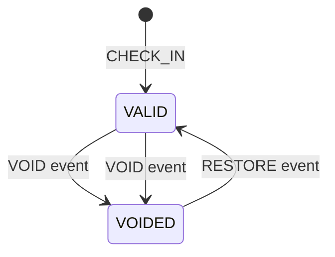

# ADR-013：Attendance Audit Timeline 与 Statistics 架构

| 项 | 内容 |
|----|------|
| 状态 | 已采纳（Sprint 7 CLOSED — 2026-07-02） |
| 日期 | 2026-07-01 |
| 决策者 | Tech Lead Design Review |
| 关联 | ADR-007 · ADR-011 · ADR-012 · `specs/attendance-audit.md` Rev 2 |

---

## 背景

Sprint 6 交付 Restore 后，`voidedAt` 在 Restore 时被置 `NULL`（ADR-012）。老师仍需追溯「签到 → 撤销 → 恢复」完整过程；同时 Phase2 需要只读运营统计（到课次数、课消、排行），为 Sprint 8 月报与导出铺垫。

Sprint 7 Design Rev 1 获 **CHANGES REQUIRED**；Rev 2 响应 RC1～RC5，冻结 Lifecycle Event 契约、Statistics Repository、ViewModel Evolution、事务写入顺序。

---

## 决策 1 — Audit Timeline vs Operation Log

（同 Rev 1 — 不变）

**结论：采用 Audit Timeline** · Operation Log ❌

---

## 决策 2 — Statistics 不调用 Student Service

（同 Rev 1 — 不变）

**结论**：`studentRepository.findByIds` + `lessonBalanceRepository.getBalances` 只读；**禁止** `studentService`。

---

## 决策 3 — Schema：`voidedAt` + Lifecycle Events

| 项 | 决策 |
|----|------|
| `attendances.voided_at` | Sprint 7 新增；void SET · restore NULL |
| `attendance_lifecycle_events` | CHECK_IN / VOID / RESTORE |
| `operator_id` | 列存在；Sprint 7 恒 NULL |
| `metadata` | jsonb；**Reserved JSON** — Sprint 7 不解析 |

---

## 决策 4 — `AttendanceStatisticsRepository`（RC2）

Statistics 聚合 **独立 Repository**，避免 Sprint 8 再次拆分。

| ✔ | ✘ |
|---|---|
| COUNT / GROUP BY | lessonBalance |
| 返回 `{ studentId, count }` | studentName |
| | Timeline |
| | Mapper |

Service 层编排：`attendanceStatisticsRepository` → `findByIds` → `getBalances` → Mapper。

---

## 决策 5 — `appendLifecycleEvent` 契约（RC1 — 冻结）

```typescript
appendLifecycleEvent({
  attendanceId,
  eventType,
  occurredAt,
  operatorId?,      // Reserved
  metadata?,         // Reserved JSON — Sprint 7 不解析
}, tx?)
```

Sprint 8+ `metadata` 示例：`voidReason` · `restoreReason` · `importSource` · `batchId`。

**不得**新增平行写入 API 或修改参数列表。

---

## 决策 6 — 生命周期状态与 Event 对应（Non-blocking · Export 友好）

```text
Attendance Status          Lifecycle Events (occurredAt 升序)
─────────────────          ─────────────────────────────────
VALID          ←── create/check-in ──→  CHECK_IN
    │
    ▼ void()
VOIDED                         VOID
    │
    ▼ restore()
VALID                          RESTORE
    │
    ▼ void()  (again)
VOIDED                         VOID
```



Sprint 8 Export / Audit Replay 直接 replay Event 序列，无需反推 status。

---

## 决策 7 — Transaction Sequence Freeze（RC5）

```text
Service
    ↓
Repository Transaction
    ↓
① Attendance UPDATE / INSERT     ← 必须先执行
    ↓
② appendLifecycleEvent(..., tx)
    ↓
COMMIT
```

**永久禁止**：先写 Event 后 UPDATE Attendance。

---

## 决策 8 — ViewModel Evolution（RC3 · RC4）

### Timeline（RC3）

`AttendanceAuditTimelineEvent` Reserved：`operatorName?` · `reason?` · `source?` — Sprint 7 恒 `null`。

### Statistics Summary（RC4）

`AttendanceStatisticsSummary` 冻结：`totalAttendance` · `validAttendance` · `voidedAttendance` · `restoreCount` · `consumedLessons` · `studentRank[]`。

Reserved：`teacherRank` · `classRank` · `monthlyTrend` · `heatmap` · `remainingLessonRank` — Sprint 7 恒 `undefined`。

Sprint 8 **不得 rename** 上述字段。

---

## 决策 9 — Statistics 分层（Non-blocking）

```text
Statistics Service
        ↓
AttendanceStatisticsRepository (aggregate only)
        ↓
studentRepository.findByIds + lessonBalanceRepository.getBalances
        ↓
Mapper
        ↓
AttendanceStatisticsSummary
```

---

## Audit Timeline 数据流（Mermaid）

```mermaid
flowchart TB
  subgraph Repo
    A[AttendanceEntity]
    E[LifecycleEvent[]]
  end
  subgraph Mapper
    M[attendance-audit.mapper]
  end
  subgraph VM
    T[AttendanceAuditTimeline]
  end
  A --> M
  E --> M
  M --> T
```

UI 只读 `T`；**禁止** UI 拼装 Event 顺序或 Reserved 字段。

---

## Required Review Topics（Rev 2）

| # | 决策 | Rev 2 |
|---|------|-------|
| 1 | Audit Timeline vs Operation Log | ✅ |
| 2 | Statistics 禁 studentService | ✅ |
| 3 | RC1 appendLifecycleEvent 冻结 | ✅ |
| 4 | RC2 AttendanceStatisticsRepository | ✅ |
| 5 | RC3 Timeline Reserved | ✅ |
| 6 | RC4 Statistics Summary Evolution | ✅ |
| 7 | RC5 Transaction Sequence | ✅ |

---

## 相关文档

- `specs/attendance-audit.md` Rev 2
- `specs/attendance-audit.plan.md` Rev 2
- `.agent/SPRINT7_DESIGN_REVIEW.md` Rev 2

---

**Rev 2 — 2026-07-01 — RC1～RC5 响应，Design FINAL APPROVED**

**Sprint 7 CLOSED — 2026-07-02 Tech Lead Final Review APPROVED**
