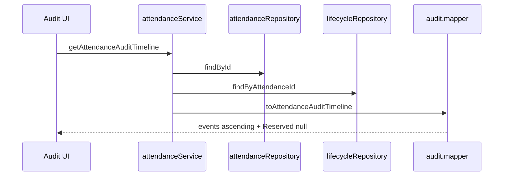

# Attendance Audit & Statistics Implementation Plan — Sprint 7

> **状态：Plan Rev 2 — Tech Lead RC1～RC5 已响应（Coding Forbidden）**
>
> 依据：`specs/attendance-audit.md` Rev 2 · ADR-013 Rev 2
>
> 本文档不含任何源码。

---

## 1. Module Overview

| 项 | 内容 |
|----|------|
| Sprint | Sprint 7 |
| Spec | `specs/attendance-audit.md` Rev 2 |
| 能力 | Audit Timeline + Statistics |
| Schema | **有变更** — `voidedAt` + `attendance_lifecycle_events` |

### 1.1 冻结（Sprint 2～6）

| 项 | 说明 |
|----|------|
| `checkInStudent` / `voidAttendance` / `restoreAttendance` | Action 签名与错误码 **不变** |
| `listAttendanceHistory` | 行为不变；Mapper 激活真实 `voidedAt` |
| `student.service` / `lesson.service` | 零改动 |
| `lesson-balance.repository` | 公开签名不变；Statistics 只读调用 |

---

## 2. Feature First Directory

```
src/features/attendance/
├── types/
│   ├── find-audit-input.type.ts              [S7 新建 — Evolution]
│   ├── find-statistics-input.type.ts         [S7 新建 — Evolution]
│   ├── attendance-audit-list-row.type.ts
│   ├── attendance-audit-timeline.type.ts
│   ├── attendance-audit-timeline-event.type.ts
│   ├── attendance-statistics-summary.type.ts
│   ├── attendance-lifecycle-event-entity.type.ts
│   └── attendance-entity.type.ts             [+voidedAt]
├── repositories/
│   ├── attendance.repository.ts              [Audit 读 + void/restore/create 写]
│   ├── attendance-lifecycle.repository.ts    [Lifecycle 读写 — RC1]
│   └── attendance-statistics.repository.ts   [Statistics 聚合 — RC2 冻结]
├── services/
│   ├── attendance.service.ts                 [History/void/restore 内部扩展]
│   └── attendance-statistics.service.ts      [S7 新建]
├── validators/
│   ├── list-attendance-audit.validator.ts
│   ├── get-attendance-audit-timeline.validator.ts
│   └── get-attendance-statistics.validator.ts
├── mappers/
│   ├── attendance-audit.mapper.ts            [Timeline 纯函数]
│   ├── attendance-history.mapper.ts          [voidedAt 真实映射]
│   └── attendance-statistics.mapper.ts
├── actions/
│   ├── list-attendance-audit.action.ts
│   ├── get-attendance-audit-timeline.action.ts
│   └── get-attendance-statistics.action.ts
└── components/
    ├── attendance-audit-page.tsx
    ├── attendance-audit-list.tsx
    ├── attendance-audit-timeline-panel.tsx
    ├── attendance-statistics-page.tsx
    └── attendance-statistics-summary.tsx

src/app/attendance/
├── audit/page.tsx
└── statistics/page.tsx

prisma/migrations/YYYYMMDD_sprint7_audit/
```

---

## 3. Repository Contract

### 3.1 Schema（M1）

**`attendances` 表扩展**

| 列 | 类型 | 说明 |
|----|------|------|
| `voided_at` | `TIMESTAMP NULL` | void 时 SET；restore 时 NULL |

**`attendance_lifecycle_events` 新表**

| 列 | 类型 | 说明 |
|----|------|------|
| `id` | cuid | PK |
| `attendance_id` | FK → attendances | |
| `student_id` | FK → students | 冗余便于统计索引 |
| `event_type` | enum `CHECK_IN` \| `VOID` \| `RESTORE` | |
| `occurred_at` | timestamp | 业务事件时间 |
| `operator_id` | string NULL | **Reserved** — Sprint 7 恒 NULL |
| `metadata` | jsonb NULL | **Reserved JSON** — Sprint 7 不解析、不写入 |
| `created_at` | timestamp | 写入时间 |

索引：`(attendance_id, occurred_at)` · `(student_id, occurred_at)` · `(event_type, occurred_at)`

### 3.2 `FindAuditInput` — Evolution（冻结）

```typescript
type FindAuditInput = {
  studentId?: string
  dateFrom?: Date | string
  dateTo?: Date | string
  status?: AttendanceStatus      // Sprint 7 实现
  teacherId?: string             // Reserved
  classId?: string               // Reserved
  cursor?: string                // Reserved
  limit?: number
}
```

语义与 `FindHistoryInput` 对齐；`findAuditList` **可内部复用** `buildFindHistoryWhere` 逻辑。

### 3.3 `FindStatisticsInput` — Evolution（冻结）

```typescript
type FindStatisticsInput = {
  dateFrom?: Date | string
  dateTo?: Date | string
  studentId?: string             // 可选单学员维度
  teacherId?: string               // Reserved
  classId?: string                 // Reserved
  rankingLimit?: number            // 默认 10
}
```

### 3.4 `appendLifecycleEvent` — RC1 冻结（Architecture Freeze）

> **Sprint 7 起签名冻结**；Sprint 8 Export / Audit Replay 依赖此契约，**不得改参**。

```typescript
type AppendLifecycleEventInput = {
  attendanceId: string
  eventType: "CHECK_IN" | "VOID" | "RESTORE"
  occurredAt: Date
  operatorId?: string | null   // Reserved — Sprint 7 不传
  metadata?: Record<string, unknown> | null  // Reserved JSON — Sprint 7 不传
}

appendLifecycleEvent(input: AppendLifecycleEventInput, tx?: TransactionClient): Promise<AttendanceLifecycleEventEntity>
```

#### `metadata` Reserved JSON（Sprint 7 不解析）

Sprint 8+ 允许写入（仍通过同一 `appendLifecycleEvent` 签名）：

| 键（示例） | 用途 |
|------------|------|
| `voidReason` | 撤销原因 |
| `restoreReason` | 恢复原因 |
| `importSource` | 批量导入来源 |
| `batchId` | 批次 ID |

Sprint 7 Repository **忽略** `metadata` / `operatorId`；列存在但不写入业务值。

**禁止**：新增平行 `insertEvent` · 修改参数列表 · Repository 内解析 metadata 影响 status

### 3.5 Attendance Repository（Audit 读 + 状态写）

| 方法 | 职责 | 禁止 |
|------|------|------|
| `findAuditList(input)` | Attendance 行（含 voidedAt） | aggregate · ViewModel |
| `findLifecycleEventsByAttendanceId(id)` | 单条 Timeline 源 | UI 排序 |
| `findLifecycleEventsByAttendanceIds(ids[])` | 批量 lastEvent | N+1 |
| `create` / `void` / `restore` | 见 §7.1 事务序 | 业务判断 · Statistics |

Lifecycle **写入** 统一经 `attendanceLifecycleRepository.appendLifecycleEvent`（§3.4）。

### 3.6 `AttendanceStatisticsRepository` — RC2 冻结

> **独立 Repository**；Sprint 8 统计扩展 **仅增方法**，不拆第二聚合层。

**职责边界**

| ✔ 负责 | ✘ 禁止 |
|--------|--------|
| SQL `COUNT` / `GROUP BY` 聚合 | `lessonBalance` 计算 |
| 返回原始 `{ studentId, count }[]` | `studentName` 查询 |
| 按 `FindStatisticsInput` 过滤 | Timeline 查询 |
| | Mapper / ViewModel 装配 |
| | 调用 `studentService` |

**冻结方法集（Sprint 7）**

```typescript
type AttendanceStatisticsRepository = {
  countTotalAttendance(filter: FindStatisticsInput): Promise<number>
  countValidAttendance(filter: FindStatisticsInput): Promise<number>
  countVoidedAttendance(filter: FindStatisticsInput): Promise<number>
  countLifecycleEvents(filter: FindStatisticsInput, eventType: LifecycleEventType): Promise<number>
  groupValidAttendanceByStudent(filter: FindStatisticsInput, limit: number): Promise<StudentAggregateRow[]>
}
```

`StudentAggregateRow = { studentId: string; validAttendance: number }` — Entity 级原始聚合，非 ViewModel。

Sprint 8 可 **新增** 如 `groupByTeacher` · `groupByMonth`，**不得**移入 `lessonBalanceRepository` 或 `studentRepository`。

### 3.7 void / restore / create — 内部扩展（签名不变 · RC5 见 §7.1）

Repository **不做**：ALREADY_VOIDED · INSUFFICIENT_BALANCE · Timeline 装配

### 3.8 完整 Repository 分层（Sprint 7 后）

| Repository | 方法域 |
|------------|--------|
| `attendanceRepository` | create · findById · findHistory · findAuditList · void · restore · existsToday · getTodayStatuses |
| `attendanceLifecycleRepository` | appendLifecycleEvent · findByAttendanceId(s) |
| `attendanceStatisticsRepository` | §3.6 聚合方法集 |

---

## 4. Service Flow

### 4.1 `listAttendanceAudit`（读）

```text
listAttendanceAuditAction
    ↓
attendanceService.listAttendanceAudit
    ↓
validateListAttendanceAuditInput
    ↓
studentRepository.findById（仅 studentId 有值）
    ↓
attendanceRepository.findAuditList
    ↓
attendanceRepository.findLifecycleEventsByAttendanceIds
    ↓
studentRepository.findByIds
    ↓
toAttendanceAuditListRowList
    ↓
ActionResult
```

### 4.2 `getAttendanceAuditTimeline`（读）

```text
getAttendanceAuditTimelineAction
    ↓
attendanceService.getAttendanceAuditTimeline
    ↓
validateGetAttendanceAuditTimelineInput
    ↓
attendanceRepository.findById
    ↓
ATTENDANCE_NOT_FOUND
    ↓
attendanceRepository.findLifecycleEventsByAttendanceId
    ↓
studentRepository.findById
    ↓
toAttendanceAuditTimeline
    ↓
ActionResult
```

**禁止**：UI 拼装 `events` 顺序 · Service 调用 `studentService`

### 4.3 `getAttendanceStatistics`（读 — 架构冻结）

```text
getAttendanceStatisticsAction
    ↓
attendanceStatisticsService.getAttendanceStatistics
    ↓
validateGetAttendanceStatisticsInput
    ↓
attendanceStatisticsRepository.countTotalAttendance
attendanceStatisticsRepository.countValidAttendance
attendanceStatisticsRepository.countVoidedAttendance
attendanceStatisticsRepository.countLifecycleEvents(RESTORE)
attendanceStatisticsRepository.countLifecycleEvents(CHECK_IN)
attendanceStatisticsRepository.groupValidAttendanceByStudent
    ↓
studentRepository.findByIds（Ranking 姓名 — 非 studentService）
    ↓
lessonBalanceRepository.getBalances（remainingLessonRank Reserved — 只读）
    ↓
toAttendanceStatisticsSummary
    ↓
ActionResult
```

**禁止**：

```text
attendanceStatisticsService → studentService        ❌
attendanceStatisticsRepository → lessonBalance     ❌（余额在 Service 层 batch 只读）
attendanceStatisticsRepository → studentName       ❌
Statistics UI → studentRepository / Repository      ❌
```

### 4.4 Sprint 6 链（不变）

`restoreAttendance` · `voidAttendance` · `listAttendanceHistory` 调用链顺序 **不变**；M1 仅在 Repository `void`/`restore`/`create` **内部**追加 Event 写入。

---

## 5. Action Contract

| Action | Input | Output | 新增 errorType |
|--------|-------|--------|----------------|
| `listAttendanceAuditAction` | `FindAuditInput` | `AttendanceAuditListRow[]` | 沿用 VALIDATION / STUDENT_NOT_FOUND |
| `getAttendanceAuditTimelineAction` | `{ attendanceId }` | `AttendanceAuditTimeline` | +`ATTENDANCE_NOT_FOUND` |
| `getAttendanceStatisticsAction` | `FindStatisticsInput` | `AttendanceStatisticsSummary` | VALIDATION only |

沿用 `{ success, data?, errorType?, fieldErrors?, message? }`。

---

## 6. UI Flow

### 6.1 Audit List

```text
/attendance/audit[?studentId=&dateFrom=&dateTo=&status=]
        ↓
Server: listAttendanceAuditAction
        ↓
AttendanceAuditPage
        ↓
Filter（URL Query — 同 Sprint 6 History）
        ↓
AttendanceAuditList
        ↓
点击行 → Timeline Panel / Detail Route
        ↓
getAttendanceAuditTimelineAction
        ↓
AttendanceAuditTimelinePanel（只读）
```

### 6.2 Statistics

```text
/attendance/statistics[?dateFrom=&dateTo=]
        ↓
Server: getAttendanceStatisticsAction
        ↓
AttendanceStatisticsPage
        ↓
AttendanceStatisticsSummary（卡片 + 排行表）
```

### 6.3 UI 约束

| 准则 | 说明 |
|------|------|
| Action Only | 同 Sprint 5/6 |
| URL Source of Truth | 筛选参数走 Query |
| Timeline | 只读 ViewModel；无 void/restore 按钮 |
| 全量刷新 | 本 Sprint 无写操作 UI |

### 6.4 导航

`/attendance` ↔ `/attendance/history` ↔ `/attendance/audit` ↔ `/attendance/statistics` ↔ `/students`

---

## 7. Transaction Boundary

### 7.1 Transaction Sequence Freeze — RC5（Architecture Freeze）

> **Sprint 7 起冻结**；任何 Sprint 写 Attendance 状态 **不得** 调整顺序，否则 Audit Replay 失真。

```text
Service（voidAttendance / restoreAttendance / checkIn → create）
        ↓
attendanceRepository.{void|restore|create} 入口
        ↓
BEGIN TRANSACTION
        ↓
① Attendance UPDATE 或 INSERT          ← 必须先于 Event
        ↓
② attendanceLifecycleRepository.appendLifecycleEvent(..., tx)
        ↓
COMMIT
```

| 操作 | ① Attendance | ② Lifecycle Event |
|------|--------------|-------------------|
| `create` | INSERT row VALID | CHECK_IN |
| `void` | UPDATE VOIDED + voided_at | VOID |
| `restore` | UPDATE VALID + voided_at=NULL | RESTORE |

**永久禁止**

```text
先 INSERT Lifecycle Event，后 UPDATE Attendance    ❌
Event 在事务外、Attendance 在事务内                 ❌
仅 UPDATE status 不写 Event                          ❌
```

M1 测试须断言：事务失败时 Attendance 与 Event **同时回滚**。

### 7.2 其他边界

| 操作 | 边界 |
|------|------|
| Audit / Statistics 读 | 无事务；只读 |
| 数据迁移 backfill | 独立 migration；补录 Event 遵循 ①→② 语义 |

---

## 8. Statistics Architecture（RC2 · Non-blocking 分层图）

```text
┌──────────────────────────────┐
│ attendanceStatisticsService  │
└──────────────┬───────────────┘
               │
               ▼
┌──────────────────────────────┐
│ attendanceStatisticsRepository│  ← aggregate only（RC2 冻结）
└──────────────┬───────────────┘
               │
       ┌───────┴────────┐
       ▼                ▼
┌─────────────┐  ┌─────────────────────┐
│ student     │  │ lessonBalance       │
│ Repository  │  │ Repository (只读)    │
│ findByIds   │  │ getBalances         │
└─────────────┘  └─────────────────────┘
               │
               ▼
┌──────────────────────────────┐
│ attendance-statistics.mapper   │
└──────────────┬───────────────┘
               ▼
     AttendanceStatisticsSummary

studentService  ✗ 不在调用链上
```

---

## 9. Audit Timeline Design



```text
AttendanceEntity (header)
        +
AttendanceLifecycleEvent[] (ordered by occurredAt)
        ↓
attendance-audit.mapper.ts（label · Reserved operatorName/reason/source = null）
        ↓
AttendanceAuditTimeline
```

| 阶段 | 负责 |
|------|------|
| Repository | 返回 Entity + Event[] |
| Mapper | 升序排序 · `label` 文案 · `lastEvent*` 派生 |
| UI | 渲染 `events`；**禁止** `if (eventType === …)` 业务分支 |

---

## 10. M1～M4 Milestones

| 里程碑 | 交付 | 测试 |
|--------|------|------|
| **M1** | Migration · `voidedAt` · Lifecycle 表 · Repository 扩展 · void/restore/create 写 Event | `test:m1-attendance-audit` |
| **M2** | Statistics Service · Audit Service · Validators · Mappers · Actions · History Mapper voidedAt | `test:m2-attendance-audit` · `test:m2-attendance-statistics` |
| **M3** | `/audit` · `/statistics` UI · 导航 | `npm run build` |
| **M4** | §6 Acceptance · Restore Regression · Sprint 2～6 全量回归 · Evidence | `test:m4-attendance-audit` |

### M1 Exit

- Migration deploy 成功
- void/restore 写入 Event 可测
- `findAuditList` / Lifecycle 查询可测
- Sprint 6 Repository 测试仍 pass（或更新断言 voidedAt）

### M2 Exit

- 三条 Action 链冻结
- Statistics 静态审计：无 studentService
- Timeline Mapper  purity 审计

### M3 Exit

- UI Action Only 审计
- URL Query 筛选

### M4 Exit

- Evidence 包 · Progress M4 · **待 Final Review**（非 CLOSED 直至批准）

---

## 11. Risks

| 风险 | 缓解 |
|------|------|
| void/restore 内部变更引入回归 | M1/M4 全量回归 · Event 与 status 同事务 |
| 历史数据无 Event | Migration backfill CHECK_IN/VOID |
| Statistics N+1 | `groupValidCountByStudent` 单查询 · `findByIds` 批量 |
| Audit 与 History 重复 | 独立路由；History 保留操作按钮 |
| Sprint 8 Export 破坏 API | Input Evolution Reserved 字段 |

---

## 12. Evolution（Sprint 8 预留）

| Sprint 8 能力 | Sprint 7 预留 |
|---------------|---------------|
| Export CSV/Excel | 复用 `FindAuditInput` / `FindStatisticsInput` |
| Teacher/Class Stats | `teacherId` / `classId` Reserved |
| Monthly Trend | 新增 Action；不改 Statistics Summary 字段 |
| Heatmap | 新增 ViewModel |
| Remaining Lesson UI | `remainingLessonRank` Reserved |

---

## 13. Rev 2 — Required Changes 落实索引

| RC | 本文档位置 |
|----|------------|
| RC1 | §3.4 `appendLifecycleEvent` |
| RC2 | §3.6 `AttendanceStatisticsRepository` · §8 |
| RC3 | Spec §4.2 · §4.3 |
| RC4 | Spec §4.4 · §4.5 |
| RC5 | §7.1 Transaction Sequence Freeze |

---

**Plan Rev 2 — 2026-07-01 — 待 Tech Lead Design FINAL APPROVAL**
