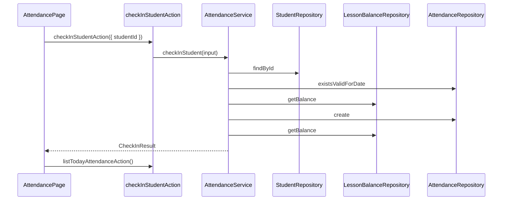

# Attendance Implementation Plan — Sprint 4

> **状态：Plan Rev 1 — 待 Tech Lead Approval**
>
> 依据：`specs/attendance.md`（Rev 1，**待 Review**）· ADR-007 · ADR-009
>
> 本文档不含任何源码。

---

## 1. Module Overview

### 1.1 模块定位

| 项 | 内容 |
|----|------|
| 模块名 | `attendance` |
| 路径 | `src/features/attendance/` |
| Sprint | Sprint 4 |
| Spec | `specs/attendance.md` |
| 关联模块 | `students`（读学员）、`lessons`（读余额；**仅** `lesson-balance.repository`） |

### 1.2 交付能力

| 能力 | 所属 Feature | 说明 |
|------|--------------|------|
| Today Attendance List | `attendance` | `AttendanceTodayRow[]` |
| Check In Student | `attendance` | 写入 `Attendance`（VALID） |
| Balance 扣减体现 | `lessons` | **仅**扩展 `lesson-balance.repository` |
| Student 列表/详情余额 | `students` | **无 Service 代码变更** |

### 1.3 不做

撤销 · Edit/Delete 签到 · ClassSession · Teacher · 签到历史 UI · 改 `LessonPackage`

### 1.4 架构约束

| ADR | 约束 |
|-----|------|
| ADR-002 | Feature First；`attendance/` 独立 |
| ADR-004 | 余额不落库 |
| ADR-007 | 余额公式唯一入口；`getBalances` / `getBalance` 签名不变 |
| ADR-009 | Attendance Schema；签到日唯一性 |

### 1.5 分层总览

```
attendanceRepository     →  AttendanceEntity
lessonBalanceRepository  →  Map / number（公式含签到，仅改内部）
attendanceService        →  AttendanceTodayRow / CheckInResult
studentService           →  不变（已消费 getBalances / getBalance）
```

---

## 2. Directory Tree

```
wenlan-crm/
├── prisma/
│   ├── schema.prisma                    [修改] Attendance model
│   └── migrations/                      [新增] init_attendance
│
├── specs/
│   ├── attendance.md
│   └── attendance.plan.md               [本文档]
│
├── src/
│   ├── app/
│   │   └── attendance/
│   │       └── page.tsx                 [新增] 薄路由
│   │
│   ├── features/
│   │   ├── attendance/
│   │   │   ├── types/
│   │   │   │   ├── attendance-entity.type.ts
│   │   │   │   ├── attendance-today-row.type.ts
│   │   │   │   ├── check-in-result.type.ts
│   │   │   │   └── check-in-input.type.ts
│   │   │   ├── errors/
│   │   │   │   └── attendance.errors.ts
│   │   │   ├── validators/
│   │   │   │   ├── rules/
│   │   │   │   └── check-in.validator.ts
│   │   │   ├── mappers/
│   │   │   │   └── attendance.mapper.ts
│   │   │   ├── repositories/
│   │   │   │   └── attendance.repository.ts
│   │   │   ├── services/
│   │   │   │   └── attendance.service.ts
│   │   │   ├── actions/
│   │   │   │   ├── list-today-attendance.action.ts
│   │   │   │   └── check-in-student.action.ts
│   │   │   └── components/
│   │   │       ├── attendance-today-list.tsx
│   │   │       ├── attendance-today-row.tsx
│   │   │       └── attendance-page.tsx
│   │   │
│   │   ├── lessons/
│   │   │   └── repositories/
│   │   │       └── lesson-balance.repository.ts   [修改] computeBalances 含签到
│   │   │
│   │   └── students/                            [无 Service 变更]
│   │
│   └── shared/
│       └── types/
│           └── action-result.type.ts              [修改] 扩展 errorType
│
└── .agent/adr/
    └── 009-attendance.md
```

---

## 3. Cross Feature Dependency（强制）

### 3.1 允许

```
attendanceService
      ├── studentRepository.findById / findAllActive（只读）
      ├── lessonBalanceRepository.getBalance / getBalances（只读）
      └── attendanceRepository（读写）

studentService
      └── lessonBalanceRepository（只读，代码不变）
```

### 3.2 禁止

```
attendanceService  ──✗──▶  studentService
attendanceService  ──✗──▶  lessonService
studentService   ──✗──▶  attendanceService / attendanceRepository
attendance UI    ──✗──▶  Service / Repository（非 Action）
lesson-balance   ──✗──▶  attendanceRepository（反向依赖）
```

### 3.3 Sprint 4 余额变更原则

| 可修改 | 不可修改 |
|--------|----------|
| `lesson-balance.repository` 内部 `computeBalances` | `student.service.ts` |
| — | `student.mapper.ts` |
| — | Attendance / Student UI 余额计算逻辑 |

---

## 4. Database Design

### 4.1 Attendance Model

| 列 | 类型 | 约束 |
|----|------|------|
| `id` | String (cuid) | PK |
| `student_id` | String | FK → students, NOT NULL |
| `attendance_date` | Date | NOT NULL |
| `status` | Enum | `VALID` / `VOIDED`, default `VALID` |
| `created_at` | DateTime | default now() |

- `@@unique([studentId, attendanceDate])`
- `@@index([attendanceDate])`
- `onDelete`: `Restrict`

### 4.2 lesson-balance.repository 扩展（唯一余额变更点）

**Sprint 4 `computeBalances` 概念逻辑**

```
purchasedMap  = GROUP BY student_id SUM(lesson_packages.quantity)
attendanceMap = GROUP BY student_id COUNT(attendances) WHERE status = VALID
balance(id)   = purchasedMap.get(id, 0) - attendanceMap.get(id, 0)
```

- 仍通过 **`getBalances` / `getBalance` 对外暴露**；签名不变
- 批量实现：固定次数查询（购课聚合 + 签到聚合），禁止 per-student 循环

---

## 5. Repository Design

### 5.1 attendanceRepository

| 方法 | 输入 | 输出 | 说明 |
|------|------|------|------|
| `create` | `CreateAttendanceEntityInput` | `AttendanceEntity` | 插入 VALID 签到 |
| `existsValidForDate` | `studentId`, `date` | `boolean` | 重复签到检查 |
| `findValidByStudentIdsAndDate` | `studentIds[]`, `date` | `Set<string>` | 批量今日已签学员 id |

**禁止**：余额计算、修改 LessonPackage

### 5.2 lessonBalanceRepository（修改）

| 方法 | 变更 |
|------|------|
| `getBalances` | 无签名变更；内部减去有效签到数 |
| `getBalance` | 无签名变更 |
| `computeBalances` | **唯一**演进签到公式之处 |

---

## 6. Service Design

### 6.1 attendanceService.listTodayAttendance

| 步骤 | 动作 |
|------|------|
| 1 | `studentRepository.findAllActive()` |
| 2 | `lessonBalanceRepository.getBalances(ids)` |
| 3 | `attendanceRepository.findValidByStudentIdsAndDate(ids, today)` |
| 4 | `attendanceMapper.toTodayRowList(entities, balanceMap, checkedInSet)` |

### 6.2 attendanceService.checkInStudent

| 步骤 | 动作 |
|------|------|
| 1 | `checkInValidator` |
| 2 | `studentRepository.findById` → `STUDENT_NOT_FOUND` |
| 3 | `status === ARCHIVED` → `STUDENT_ARCHIVED` |
| 4 | `existsValidForDate` → `ALREADY_CHECKED_IN` |
| 5 | `getBalance < 1` → `INSUFFICIENT_BALANCE` |
| 6 | `attendanceRepository.create` |
| 7 | `getBalance` → `CheckInResult` |

**事务**：Sprint 4 单表 INSERT，无需 `$transaction`。

### 6.3 studentService

**无变更。** 列表/详情已在 Sprint 3 调用 `getBalances` / `getBalance`；Sprint 4 扩展 repository 内部后自动反映扣课。

---

## 7. Validation Design

### 7.1 checkInValidator

| 规则 | 字段 | 条件 |
|------|------|------|
| `STUDENT_ID_REQUIRED` | studentId | 非空 string |
| `DATE_REQUIRED` | attendanceDate | 可选；默认今日；合法日期 |

### 7.2 errorType（扩展 shared ActionResult）

| errorType | 场景 |
|-----------|------|
| `VALIDATION_ERROR` | 字段校验失败 |
| `STUDENT_NOT_FOUND` | 学员不存在 |
| `STUDENT_ARCHIVED` | 已归档 |
| `ALREADY_CHECKED_IN` | 今日已签 |
| `INSUFFICIENT_BALANCE` | 余额 < 1 |
| `INTERNAL_ERROR` | 未预期异常 |

沿用 `shared/types/action-result.type.ts`；**禁止**新建 Attendance 专属协议。

---

## 8. Server Action Design

| Action | 输入 | 输出（成功） |
|--------|------|--------------|
| `listTodayAttendanceAction` | `{ date? }` | `AttendanceTodayRow[]` |
| `checkInStudentAction` | `{ studentId, attendanceDate? }` | `CheckInResult` |

调用链：Action → **attendanceService** only

---

## 9. Component Tree

```
AttendancePage
├── PageHeader（标题 + 日期）
└── AttendanceTodayList
      └── AttendanceTodayRow（余额 · 状态 · 签到按钮）
```

| 组件 | 允许 import |
|------|-------------|
| `attendance-page.tsx` | attendance Actions |
| `attendance-today-list.tsx` | types + UI |
| `attendance-today-row.tsx` | 回调 props；无 Action |

---

## 10. Sequence Diagram

### 10.1 Check In



---

## 11. Risk

| # | 风险 | 缓解 |
|---|------|------|
| 1 | 修改 student.service | 禁止；仅改 balance repository |
| 2 | 今日名单 N+1 | 批量 getBalances + findValidByStudentIdsAndDate |
| 3 | 时区导致「今日」歧义 | ADR-009 明确 date 规则 |
| 4 | unique 冲突竞态 | Service 前置 exists + DB unique 双保险 |
| 5 | Service 互调 | §3 依赖规则 |

---

## 12. Implementation Order

```
Step 1   ADR-009 + Plan Approval
Step 2   prisma Attendance + migration
Step 3   扩展 lesson-balance.repository（computeBalances）
Step 4   attendance types / errors / validators / mapper
Step 5   attendance.repository + attendance.service
Step 6   actions + 扩展 shared action-result errorType
Step 7   test:m1-attendance / test:m2-attendance
Step 8   验证 student test:m2 / test:m4 回归（余额含签到）
Step 9   UI components + app/attendance/page.tsx
Step 10  npm run build
Step 11  specs/attendance.md §5.3 验收（test:m4-attendance）
Step 12  更新 .agent 文档
```

### 12.1 里程碑

| 里程碑 | 完成标志 |
|--------|----------|
| M1 数据层 | migration；attendance repo + balance 公式扩展 |
| M2 业务层 | checkIn + listToday；student 回归通过 |
| M3 UI | `/attendance` 页；分层合规 |
| M4 Acceptance | §5.3 八条 + 全链路 |

---

## 修订记录

| 版本 | 日期 | 变更 |
|------|------|------|
| Rev 1 | 2026-06-29 | 初版 Plan |

---

**状态：Plan Rev 1 — 等待 Tech Lead Approval。Approval 后按 §12 开始 M1 编码。**
