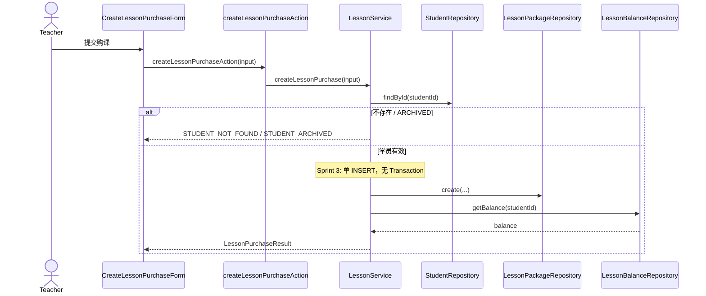
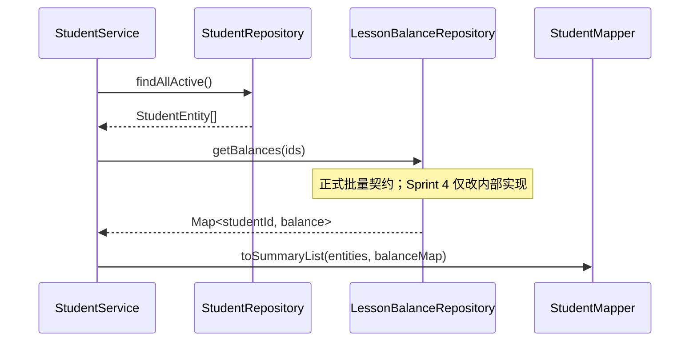

# Lesson Implementation Plan — Sprint 3

> **状态：Plan Rev 2 — 待 Tech Lead Approval**
>
> 依据：`specs/lesson.md`（Rev 1，**APPROVED**）· ADR-007（Rev 2）
>
> 修订：Tech Lead Design Review — Required Change 1–5
>
> 本文档不含任何源码。

---

## 1. Module Overview

### 1.1 模块定位

| 项 | 内容 |
|----|------|
| 模块名 | `lessons` |
| 路径 | `src/features/lessons/` |
| Sprint | Sprint 3 |
| Spec | `specs/lesson.md` |
| 关联模块 | `students`（余额展示；跨 Feature 只读依赖） |

### 1.2 交付能力

| 能力 | 所属 Feature | 说明 |
|------|--------------|------|
| Create Lesson Purchase | `lessons` | 写入 `LessonPackage` |
| Lesson Balance（列表） | `students`（增强） | `StudentSummary.lessonBalance` 真实计算值 |
| Lesson Balance（详情） | `students`（增强） | `StudentDetail.lessonBalance` 真实计算值 |
| 购课 UI | `students` + `lessons` components | 详情入口 + 购课表单 |

### 1.3 不做

签到 · 扣课 · 撤销 · 购课 Edit/Delete · 支付 · 购课历史列表 UI · Auth

### 1.4 架构约束（来自 Spec + ADR）

| ADR | 约束 |
|-----|------|
| ADR-002 | Feature First；`lessons/` 与 `students/` 分离 |
| ADR-004 | Student 禁止持久化 `lessonBalance` |
| ADR-007 | 余额 = 购课总数 − 已签到总数；`lesson-balance.repository` 唯一实现；不落库 |

### 1.5 分层总览

```
UI  →  Server Action  →  Service  →  Validator  →  Repository  →  Database
```

**Entity / ViewModel 边界**

```
lessonPackageRepository   →  LessonPackageEntity（仅 CRUD，不算余额）
lessonBalanceRepository   →  Map<studentId, number>（读模型，公式唯一实现点）
lessonService             →  LessonPurchaseResult（ViewModel）
studentService            →  仅依赖 lessonBalanceRepository；Mapper 装配 lessonBalance
```

---

## 2. Directory Tree

```
wenlan-crm/
├── prisma/
│   ├── schema.prisma                         [修改] 追加 LessonPackage model
│   └── migrations/                           [新增] init_lesson_package
│
├── specs/
│   ├── lesson.md                             [已有] Spec
│   └── lesson.plan.md                        [本文档]
│
├── src/
│   ├── features/
│   │   ├── lessons/
│   │   │   ├── types/
│   │   │   │   ├── lesson-package-entity.type.ts
│   │   │   │   ├── create-lesson-purchase-input.type.ts
│   │   │   │   └── lesson-purchase-result.type.ts
│   │   │   ├── errors/
│   │   │   │   └── lesson.errors.ts
│   │   │   ├── validators/
│   │   │   │   ├── rules/
│   │   │   │   │   ├── positive-integer.rule.ts
│   │   │   │   │   └── optional-note.rule.ts
│   │   │   │   └── create-lesson-purchase.validator.ts
│   │   │   ├── repositories/
│   │   │   │   ├── lesson-package.repository.ts    ← 仅 CRUD
│   │   │   │   └── lesson-balance.repository.ts    ← 仅余额聚合
│   │   │   ├── services/
│   │   │   │   └── lesson.service.ts
│   │   │   ├── actions/
│   │   │   │   └── create-lesson-purchase.action.ts
│   │   │   └── components/
│   │   │       └── create-lesson-purchase-form.tsx
│   │   │
│   │   └── students/
│   │       ├── services/student.service.ts       [修改] 接入真实余额
│   │       ├── mappers/student.mapper.ts         [修改] 移除 buildZeroLessonBalanceMap
│   │       └── components/                       [修改] 购课入口 + 编排
│   │
│   └── shared/
│       ├── lib/db.ts
│       └── types/
│           └── action-result.type.ts             [新增/提取] 两 Feature 共用
│
└── .agent/adr/
    └── 007-lesson-balance.md                   [Rev 2]
```

### 2.1 文件职责

| 文件 | 职责 | 为何独立 |
|------|------|----------|
| `lesson-package.repository.ts` | `LessonPackage` CRUD | **禁止**余额计算；与读模型分离 |
| `lesson-balance.repository.ts` | 余额批量/单条聚合 | Attendance 上线后**仅改此文件**；Student Feature 唯一跨 Feature 依赖点 |
| `lesson.service.ts` | 购课业务编排 | 写操作 + 购课后读余额 |
| `shared/types/action-result.type.ts` | 统一 Action 返回契约 | 禁止 Lesson 自建第二套协议 |

---

## 3. Cross Feature Dependency（强制）

> Tech Lead Required Change 4：Feature 之间**禁止互调 Service**；跨 Feature 仅允许 Repository 级只读依赖。

### 3.1 允许

```
Student Service
      │
      ▼
Lesson Balance Repository（只读）

Lesson Service
      │
      ▼
Student Repository.findById（只读，购课前校验学员）
```

| 依赖方 | 被依赖方 | 说明 |
|--------|----------|------|
| `studentService` | `lessonBalanceRepository` | 列表/详情读余额 |
| `lessonService` | `studentRepository.findById` | 购课前确认学员存在 |
| `students` UI | `lessons` Action | UI 可编排多 Feature 的 Action |

### 3.2 禁止

```
Student Service  ──✗──▶  Lesson Service
Student Service  ──✗──▶  Lesson Package Repository
Lesson Service   ──✗──▶  Student Service
students UI      ──✗──▶  lessonService / any Repository
Lesson Package Repository ──✗──▶  Attendance（Sprint 4 也不反向依赖）
```

| 依赖方 | 被依赖方 | 原因 |
|--------|----------|------|
| `studentService` | `lessonService` | Service 互调导致 Feature 耦合 |
| `studentService` | `lessonPackageRepository` | Student 只消费余额读模型，不触购课写模型 |
| `lessonService` | `studentService` | 同上 |
| 任意 UI | Service / Repository（非本 Feature Action） | 分层边界 |

### 3.3 Sprint 4 防腐化原则

Attendance 引入后：

- `lesson-balance.repository` 内聚合 `purchasedTotal − attendanceTotal`
- `studentService` **不改**余额调用代码
- **禁止**出现 `Student → LessonPackageRepository → AttendanceRepository` 链式依赖

---

## 4. Dependency Graph

### 4.1 Lesson 模块调用链（购课）

```
CreateLessonPurchaseForm
        ↓
createLessonPurchaseAction
        ↓
lessonService.createLessonPurchase
        ├── createLessonPurchaseValidator
        ├── studentRepository.findById          ← 跨 Feature 只读
        ├── lessonPackageRepository.create      ← 仅 INSERT
        └── lessonBalanceRepository.getBalance  ← 购课后读余额
                ↓
        LessonPurchaseResult
```

### 4.2 Student 模块余额增强

**Student List**

```
studentRepository.findAllActive()
        ↓
lessonBalanceRepository.getBalances(ids)      ← 正式批量契约
        ↓
studentMapper.toSummaryList(entities, balanceMap)
```

**Student Detail**

```
studentRepository.findById(id)
        ↓
lessonBalanceRepository.getBalance(id)          ← 正式单条契约
        ↓
studentMapper.toDetail(entity, balance)
```

---

## 5. Database Design

### 5.1 LessonPackage Model（Prisma）

| 列 | 类型 | 约束 |
|----|------|------|
| `id` | String (cuid) | PK |
| `student_id` | String | FK → students.id, NOT NULL |
| `quantity` | Int | NOT NULL, > 0 |
| `note` | String? | nullable |
| `purchased_at` | DateTime | default now() |
| `created_at` | DateTime | default now() |

- `Student` 1 — N `LessonPackage`
- `onDelete`: `Restrict`
- `@@index([studentId])`

**Sprint 3 不建**：`Attendance` 表、任何余额缓存列

### 5.2 Student 无变更

`Student` 表结构不变；仅新增 relation（ADR-006）。

---

## 6. Repository Design

> Tech Lead Required Change 1：**两个 Repository 职责硬边界**，禁止合并或交叉计算。

### 6.1 lessonPackageRepository — 仅 CRUD

**职责**：`LessonPackage` 数据访问；**不计算余额**；不感知 Attendance。

| 方法 | 输入 | 输出 | 说明 |
|------|------|------|------|
| `create` | `CreateLessonPackageEntityInput` | `LessonPackageEntity` | 插入购课记录 |
| `findByStudentId` | `studentId` | `LessonPackageEntity[]` | 按学员查购课记录（测试 / 未来扩展用；Sprint 3 UI 不展示） |

**`CreateLessonPackageEntityInput`**

| 字段 | 说明 |
|------|------|
| `studentId` | 已校验 |
| `quantity` | 已校验正整数 |
| `note` | null 或 string |

**禁止**

- `sumQuantityByStudentId` 等聚合方法（归属 `lesson-balance.repository`）
- 返回 ViewModel
- 业务校验

### 6.2 lessonBalanceRepository — 仅余额聚合

**职责**：**唯一**实现 `lessonBalance` 公式；Sprint 4 Attendance **全部接这里**；Student Feature **只能依赖此 Repository**。

> Tech Lead Required Change 2：**批量接口为正式契约**，Sprint 3 即实现，不等 Sprint 4。

#### 正式 API 契约

| 方法 | 签名 | 返回 | 用途 |
|------|------|------|------|
| `getBalances` | `(studentIds: string[])` | `Map<string, number>` | **Student List**；单次批量查询 |
| `getBalance` | `(studentId: string)` | `number` | **Student Detail**、购课成功后；可内部委托 `getBalances([id])` |

**契约保证**

- `getBalances([])` → 空 `Map`
- 无购课记录的 id → `Map` 中不含该 key 或值为 `0`（实现统一为：缺失 key 视为 `0`）
- Sprint 4 加 Attendance 后：**方法签名不变**，仅内部 SQL 增加签到聚合

**Sprint 3 内部逻辑**

```
balance = SUM(lesson_packages.quantity WHERE student_id IN (...)) − 0
```

**Sprint 4 扩展（仅改本文件内部）**

```
balance = purchasedTotal − validAttendanceTotal
```

**禁止**

- 写入操作
- 被 `lessonPackageRepository` 反向调用
- 在 `studentService` 内重复公式

### 6.3 列表批量策略（禁止 N+1）

```sql
-- getBalances 概念实现（Sprint 3）
SELECT student_id, SUM(quantity) AS purchased
FROM lesson_packages
WHERE student_id IN (...)
GROUP BY student_id
```

`studentService.listActiveStudents`：**禁止**对 `entities` 逐条调用 `getBalance`。

---

## 7. Service Design

### 7.1 lessonService.createLessonPurchase

| 步骤 | 层 | 动作 |
|------|-----|------|
| 1 | Validator | 校验 `studentId`、`quantity`、`note` |
| 2 | studentRepository | `findById` → 不存在则 `STUDENT_NOT_FOUND` |
| 3 | lessonService | `status === ARCHIVED` → `STUDENT_ARCHIVED` |
| 4 | lessonPackageRepository | `create` |
| 5 | lessonBalanceRepository | `getBalance(studentId)` |
| 6 | 返回 | `LessonPurchaseResult`（含最新 `lessonBalance`） |

### 7.2 事务边界（Required Change 3）

**当前 Sprint 3**

- `createLessonPurchase` 仅涉及 **单表 INSERT**（`lesson_packages`）
- **无需**显式 Prisma Transaction

**未来扩展（Payment / Coupon / Invoice / Audit Log）**

- 一次业务涉及**多表写入**时，**统一由 Service 层**开启 `prisma.$transaction`
- Repository 方法接收 `tx` 客户端参数（或 transaction context），**禁止**在 Repository 内自行 `begin/commit`

```
lessonService.createLessonPurchase（未来）
    └── prisma.$transaction(async (tx) => {
            lessonPackageRepository.create(input, tx)
            paymentRepository.create(..., tx)      // 示例
            auditLogRepository.create(..., tx)     // 示例
        })
    └── lessonBalanceRepository.getBalance(id)   // 事务提交后读
```

> 余额读取在事务**提交后**执行，确保读到已提交数据。

### 7.3 studentService 变更

| 方法 | 变更 |
|------|------|
| `listActiveStudents` | `findAllActive` → `getBalances(ids)` → `toSummaryList` |
| `getStudentDetail` | `findById` → `getBalance(id)` → `toDetail` |
| `createStudent` | 新学员无购课 → `getBalance` 为 0（不变） |

**移除**：`buildZeroLessonBalanceMap`（Sprint 2 占位）

---

## 8. Validation Design

### 8.1 createLessonPurchaseValidator

| 规则 ID | 字段 | 条件 | 错误消息 |
|---------|------|------|----------|
| `STUDENT_ID_REQUIRED` | studentId | 非空 string | 无效的学员 |
| `QUANTITY_REQUIRED` | quantity | 必填 | 请填写课时数 |
| `QUANTITY_POSITIVE` | quantity | 整数 ≥ 1 | 课时数必须大于 0 |
| `QUANTITY_MAX` | quantity | ≤ 9999 | 课时数过大 |
| `NOTE_MAX_LENGTH` | note | ≤ 500 | 备注不能超过 500 字 |

---

## 9. Action Result Contract（Required Change 5）

**禁止**新建 Lesson 专属 `ActionResult` 类型。延续 Sprint 2 统一结构：

### 9.1 统一返回结构

提取至 `src/shared/types/action-result.type.ts`（或扩展现有 students 类型并迁移 import）：

```typescript
type ActionResult<T> =
  | { success: true; data: T }
  | {
      success: false
      errorType: ErrorType
      message?: string
      fieldErrors?: Record<string, string>
    }
```

字段：**`success` · `data` · `errorType` · `fieldErrors` · `message`** — 与 Student Module 完全一致。

### 9.2 Lesson 模块 errorType

| errorType | 场景 |
|-----------|------|
| `VALIDATION_ERROR` | 字段校验失败 |
| `STUDENT_NOT_FOUND` | 学员不存在 |
| `STUDENT_ARCHIVED` | 学员已归档，不可购课 |
| `INTERNAL_ERROR` | 未预期异常 |

> 不引入 `LESSON_*` 前缀错误码；不新增第二套协议。

### 9.3 createLessonPurchaseAction 契约

| 项 | 内容 |
|----|------|
| 输入 | `{ studentId, quantity, note? }` |
| 成功 | `{ success: true, data: LessonPurchaseResult }` |
| 校验失败 | `{ success: false, errorType: 'VALIDATION_ERROR', fieldErrors }` |
| 学员不存在 | `{ success: false, errorType: 'STUDENT_NOT_FOUND', message }` |
| 学员已归档 | `{ success: false, errorType: 'STUDENT_ARCHIVED', message }` |
| 调用链 | Action → **lessonService.createLessonPurchase** |

### 9.4 既有 Student Action（行为增强，契约不变）

| Action | 变更 |
|--------|------|
| `listStudentsAction` | `data[].lessonBalance` 为真实计算值 |
| `getStudentAction` | `data.lessonBalance` 为真实计算值 |
| `createStudentAction` | 仍返回 `lessonBalance: 0` |

---

## 10. Component Tree

```
StudentsPage
├── StudentList
├── CreateStudentForm
├── StudentDetailView
│     └── [录入课时] → CreateLessonPurchaseForm
└── CreateLessonPurchaseForm
      └── Dialog：quantity + note
```

| 组件 | 允许 import |
|------|-------------|
| `create-lesson-purchase-form.tsx` | `createLessonPurchaseAction`、types、shared UI |
| `student-detail-view.tsx` | types、shared UI |
| `students-page.tsx` | student Actions + lesson Action |

---

## 11. Sequence Diagram

### 11.1 Create Lesson Purchase



### 11.2 List Students with Balance



---

## 12. Risk

| # | 风险 | 等级 | 缓解 |
|---|------|------|------|
| 1 | 列表 N+1 | 高 | 强制 `getBalances(ids)` 正式契约 |
| 2 | Package / Balance Repository 职责混淆 | 高 | §6 硬边界；Code Review |
| 3 | Service 互调 | 高 | §3 Cross Feature Dependency |
| 4 | 第二套 ActionResult | 中 | §9 统一 shared 类型 |
| 5 | 事务写进 Repository | 中 | §7.2 Service 层 `$transaction` |
| 6 | Sprint 4 Attendance 改 Student Service | 低 | 仅改 `lesson-balance.repository` |

---

## 13. Implementation Order

```
Step 1   ADR-007 Rev 2 + Plan Rev 2 Approval
Step 2   shared/types/action-result.type.ts（从 students 提取）
Step 3   prisma schema LessonPackage + migration
Step 4   features/lessons/types/*
Step 5   lesson-package.repository（create + findByStudentId）
Step 6   lesson-balance.repository（getBalance + getBalances）
Step 7   validators + lesson.service + create-lesson-purchase.action
Step 8   修改 student.service + student.mapper
Step 9   Repository / Service 自测
Step 10  UI 组件 + 编排
Step 11  build + specs/lesson.md §5.3 验收
Step 12  更新 .agent 文档
```

### 13.1 里程碑

| 里程碑 | 完成标志 |
|--------|----------|
| M1 数据层 | migration；两 Repository 职责分离可测 |
| M2 业务层 | 购课链路；`getBalances` / `getBalance` 契约通 |
| M3 UI | 购课表单 + 详情入口；分层合规 |
| M4 Acceptance | §5.3 八条 + 全链路联调 |

---

## 修订记录

| 版本 | 日期 | 变更 |
|------|------|------|
| Rev 1 | 2026-06-29 | 初版 Plan |
| Rev 2 | 2026-06-29 | RC1 Repository 职责拆分；RC2 批量 API 正式契约；RC3 事务边界；RC4 Cross Feature Dependency；RC5 统一 ActionResult |

---

**状态：Plan Rev 2 — 等待 Tech Lead Approval。Approval 后按 §13 开始 M1 编码。**
