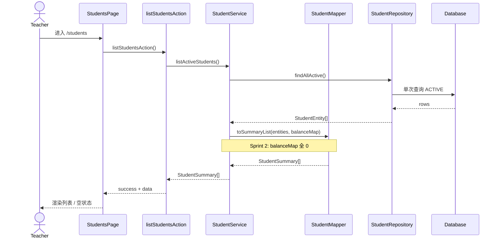
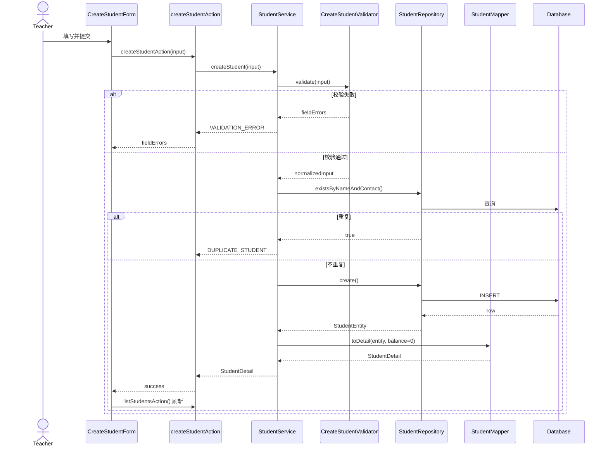
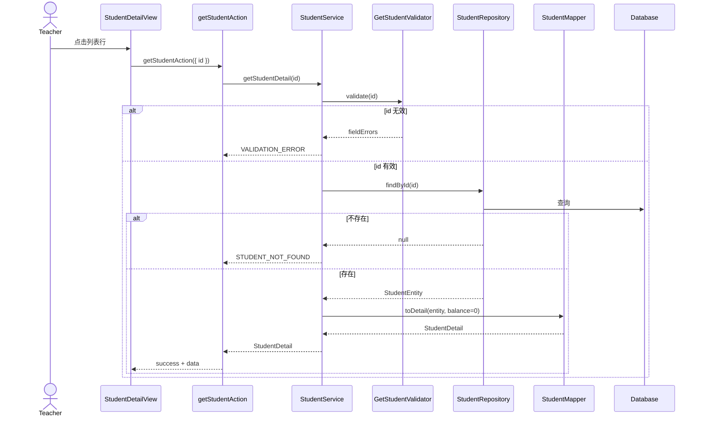

# Student Implementation Plan — Sprint 2

> **状态：Plan Rev 2 — 待 Tech Lead Approval**
>
> 依据：`specs/student.md`（Rev 2，**APPROVED**）
>
> 修订：Tech Lead Review Comment 1（Required）+ Comment 2（Recommended）
>
> 本文档不含任何源码。

---

## 1. Module Overview

### 1.1 模块定位

| 项 | 内容 |
|----|------|
| 模块名 | `students` |
| 路径 | `src/features/students/` |
| Sprint | Sprint 2 |
| Spec | `specs/student.md` |

### 1.2 交付能力

| 能力 | 说明 |
|------|------|
| Student List | 展示全部 ACTIVE 学员；`StudentSummary` 含 `lessonBalance` |
| Create Student | 表单创建；`name + contactName` 唯一 |
| View Student Detail | 只读 `StudentDetail`；含 `lessonBalance` |

### 1.3 不做

Edit · Delete · Search · Pagination · Import · Export · Batch · Auth · Lesson 相关功能

### 1.4 架构约束（来自 Spec + ADR）

| ADR | 约束 |
|-----|------|
| ADR-002 | Feature First；路由薄层 |
| ADR-004 | 禁止 Student 持久化 `lessonBalance` |
| ADR-005 | 不引入 Household；Schema 不与未来演进硬冲突 |

### 1.5 分层总览（Rev 2）

```
UI  →  Server Action  →  Service  →  Validator  →  Repository  →  Database
```

**Entity / ViewModel 边界**

```
Repository  →  StudentEntity（仅持久化字段）
Service     →  StudentEntity  →  StudentSummary / StudentDetail（ViewModel）
```

---

## 2. Directory Tree

```
wenlan-crm/
├── prisma/
│   ├── schema.prisma                    [修改] 追加 Student model、StudentStatus enum
│   └── migrations/                      [新增] 首次 Student 迁移
│
├── specs/
│   ├── student.md                       [已有] Spec（APPROVED）
│   └── student/
│       └── student.plan.md              [本文档]
│
├── src/
│   ├── app/
│   │   ├── page.tsx                     [修改] 重定向至 /students
│   │   └── students/
│   │       └── page.tsx                 [新增] 路由入口，组合 StudentsPage
│   │
│   ├── features/students/
│   │   ├── types/
│   │   │   ├── student-entity.type.ts     [新增] StudentEntity（Repository 层）
│   │   │   ├── student-summary.type.ts    [新增] StudentSummary ViewModel
│   │   │   ├── student-detail.type.ts     [新增] StudentDetail ViewModel
│   │   │   ├── create-student-input.type.ts [新增] 创建入参形状
│   │   │   └── action-result.type.ts      [新增] Action 统一返回结构
│   │   │
│   │   ├── errors/
│   │   │   └── student.errors.ts          [新增] 错误码与消息常量
│   │   │
│   │   ├── validators/                    [由 Service 调用，Action 不直接调用]
│   │   │   ├── rules/
│   │   │   │   ├── required-string.rule.ts
│   │   │   │   ├── optional-phone.rule.ts
│   │   │   │   ├── student-id.rule.ts     [新增] id 非空校验（Get Detail 用）
│   │   │   │   └── optional-note.rule.ts
│   │   │   ├── create-student.validator.ts
│   │   │   └── get-student.validator.ts   [新增] 详情 id 校验
│   │   │
│   │   ├── mappers/
│   │   │   └── student.mapper.ts          [新增] Entity → ViewModel；含 lessonBalance 装配
│   │   │
│   │   ├── repositories/
│   │   │   └── student.repository.ts      [新增] 仅返回 StudentEntity
│   │   │
│   │   ├── services/
│   │   │   └── student.service.ts         [新增] 入口编排；调用 Validator；Entity→ViewModel
│   │   │
│   │   ├── actions/
│   │   │   ├── list-students.action.ts
│   │   │   ├── create-student.action.ts
│   │   │   └── get-student.action.ts
│   │   │
│   │   └── components/
│   │       ├── students-page.tsx
│   │       ├── student-list.tsx
│   │       ├── create-student-form.tsx
│   │       └── student-detail-view.tsx
│   │
│   └── shared/
│       ├── lib/db.ts
│       └── components/ui/
│
└── .agent/adr/
    └── 006-student-schema.md              [新增] 编码时写入
```

### 2.1 文件职责与拆分理由

| 文件 / 目录 | 职责 | 为何独立 |
|-------------|------|----------|
| `types/student-entity.type.ts` | 数据库 Entity 形状 | Repository 专用；**不依赖 ViewModel** |
| `types/student-summary\|detail.type.ts` | 对外 ViewModel | UI / Action 消费；Service 产出 |
| `mappers/student.mapper.ts` | Entity → ViewModel | 映射与 `lessonBalance` 装配集中一处 |
| `validators/` | 字段与入参校验 | 由 **Service** 统一调用；Action 不 import |
| `repositories/` | 纯数据访问；返回 `StudentEntity` | 禁止 ViewModel、禁止业务规则 |
| `services/` | 业务入口；Validator → Repository → Mapper | 保证所有业务路径经 Validator |
| `actions/` | 请求边界；**仅调用 Service** | 薄层；禁止触库、禁止直调 Validator |
| `components/` | 展示与交互 | 按 Spec 三个能力拆分 |

---

## 3. Dependency Graph

### 3.1 调用方向（自上而下）

```
┌─────────────────────────────────────────────────────────┐
│  UI（students-page / list / form / detail-view）         │
└───────────────────────────┬─────────────────────────────┘
                            │ 调用
┌───────────────────────────▼─────────────────────────────┐
│  Server Action（list / create / get）                     │
│  · 解析入参 · 统一错误包装 · 仅调用 Service                 │
│  · 禁止触库 · 禁止直接调用 Validator                        │
└───────────────────────────┬─────────────────────────────┘
                            │ 调用
┌───────────────────────────▼─────────────────────────────┐
│  Service（student.service）                               │
│  · 业务入口 · 调用 Validator · 编排 Repository             │
│  · Entity → ViewModel 映射（Mapper）                       │
│  · 重复检查 · normalize                                   │
└───────────────┬─────────────────────────┬───────────────┘
                │ 调用                     │ 调用
┌───────────────▼──────────────┐  ┌───────▼─────────────────┐
│  Validator（rules + 组合器）  │  │  Mapper                 │
│  · 字段格式 · 必填 · id 校验   │  │  · Entity → Summary     │
│  · 返回字段级错误              │  │  · Entity → Detail      │
└──────────────────────────────┘  │  · 装配 lessonBalance   │
                                  └─────────────────────────┘
                │ 校验通过后调用
┌───────────────▼─────────────────────────────────────────┐
│  Repository（student.repository）                         │
│  · 仅返回 StudentEntity · 禁止依赖 ViewModel              │
└───────────────────────────┬─────────────────────────────┘
                            │
┌───────────────────────────▼─────────────────────────────┐
│  Database（Student 表）                                    │
└─────────────────────────────────────────────────────────┘
```

### 3.2 依赖规则

| 规则 | 说明 |
|------|------|
| UI → Action | UI 不得调用 Service / Repository / Validator |
| Action → Service | Action **仅**调用 Service；禁止直调 Validator / Repository |
| Service → Validator | 所有需校验的业务入口**必须**先经 Validator |
| Service → Repository | 校验通过后，Service 调用 Repository |
| Service → Mapper | Repository 返回 Entity 后，Service 调用 Mapper 生成 ViewModel |
| Repository → Entity | Repository **仅**返回 `StudentEntity`（或 `null` / `boolean`） |
| Repository ↛ ViewModel | Repository 禁止 import Summary / Detail 类型 |
| Validator ↛ Repository | Validator 无数据访问 |
| Mapper ↛ Repository | Mapper 纯函数，只做形状转换 |

### 3.3 类型依赖方向

```
StudentEntity          ← Repository 产出
       ↓
StudentMapper          ← Service 调用
       ↓
StudentSummary / StudentDetail   ← Service 产出 → Action → UI
```

---

## 4. Repository Design

### 4.1 职责

- 封装 Student 表的全部读写
- **仅返回 `StudentEntity`**（数据库持久化字段）
- **不返回、不依赖** `StudentSummary` / `StudentDetail` ViewModel
- 不包含字段校验、重复检查、ViewModel 映射
- 不包含 `lessonBalance`（非持久化字段，ADR-004）

### 4.2 StudentEntity 定义

| 字段 | 说明 |
|------|------|
| `id` | 主键 |
| `name` | 学员姓名 |
| `contactName` | 联系人 |
| `phone` | 电话，可 null |
| `note` | 备注，可 null |
| `status` | ACTIVE / ARCHIVED |
| `createdAt` | 登记时间 |
| `updatedAt` | 更新时间 |

> **Entity 仅含 Student 表列。不含 `lessonBalance`。**

### 4.3 方法清单

| 方法 | 输入 | 输出 | 说明 |
|------|------|------|------|
| `findAllActive` | 无 | `StudentEntity[]` | `status = ACTIVE`；`createdAt DESC`；单次查询 |
| `findById` | `studentId` | `StudentEntity \| null` | 按 id 查询；不限 status |
| `existsByNameAndContact` | `name`, `contactName` | `boolean` | 不限 status |
| `create` | `CreateStudentEntityInput` | `StudentEntity` | 写入；默认 `status = ACTIVE` |

**`CreateStudentEntityInput`（写入用，非 ViewModel）**

| 字段 | 说明 |
|------|------|
| `name` | 已 normalize |
| `contactName` | 已 normalize |
| `phone` | null 或 string |
| `note` | null 或 string |

### 4.4 Repository 禁止事项

- 返回 `StudentSummary` / `StudentDetail`
- import ViewModel 类型
- 在 Repository 内计算或附加 `lessonBalance`
- 业务校验与重复检查

### 4.5 N+1 与 lessonBalance（跨层协作）

| 层 | Sprint 2 | 未来 Sprint |
|----|----------|-------------|
| Repository | `findAllActive` 单次返回 `StudentEntity[]` | 可选新增 `findLessonBalancesByStudentIds(ids)` 单次批量返回 Map（非 Entity，属读模型辅助） |
| Service | Mapper 装配 `lessonBalance = 0` | 先批量取 balance Map，再 Mapper 装配；**禁止**逐条查 |

---

## 5. Service Design

### 5.1 职责

- **所有业务入口的唯一编排者**
- 调用 Validator（保证每个需校验的路径都经过 Validator）
- 调用 Repository 获取 `StudentEntity`
- 调用 Mapper 将 Entity 转为 ViewModel
- 执行业务规则（重复检查、字符串 normalize）
- 返回 ViewModel 或结构化错误

### 5.2 方法清单

| 方法 | Validator | Repository | Mapper 输出 |
|------|-----------|------------|-------------|
| `listActiveStudents` | 无（无入参） | `findAllActive` | `StudentSummary[]` |
| `getStudentDetail` | `getStudentValidator(id)` | `findById` | `StudentDetail` |
| `createStudent` | `createStudentValidator(input)` | `existsByNameAndContact` → `create` | `StudentDetail` |

### 5.3 调用关系

```
listActiveStudents()
    └── repository.findAllActive()
            └── StudentEntity[]
                    └── mapper.toSummaryList(entities, lessonBalanceMap)
                            └── lessonBalanceMap: Sprint 2 全 0
                            └── StudentSummary[]

getStudentDetail(id)
    └── getStudentValidator.validate(id)
            ├── 失败 → VALIDATION_ERROR
            └── 通过
                    └── repository.findById(id)
                            ├── null → STUDENT_NOT_FOUND
                            └── entity → mapper.toDetail(entity, lessonBalance=0)
                                    └── StudentDetail

createStudent(rawInput)
    └── createStudentValidator.validate(rawInput)
            ├── 失败 → VALIDATION_ERROR
            └── normalizedInput
                    └── repository.existsByNameAndContact(name, contactName)
                            ├── true → DUPLICATE_STUDENT
                            └── false → repository.create(normalizedInput)
                                    └── entity → mapper.toDetail(entity, lessonBalance=0)
                                            └── StudentDetail
```

### 5.4 Entity → ViewModel 映射（Mapper）

| 源 | 目标 | 附加字段 |
|----|------|----------|
| `StudentEntity` | `StudentSummary` | `lessonBalance`（Service 传入，Sprint 2 = 0） |
| `StudentEntity` | `StudentDetail` | `lessonBalance`（Service 传入，Sprint 2 = 0） |

### 5.5 业务规则明细

| 规则 | 处理位置 |
|------|----------|
| 列表仅 ACTIVE | Repository 查询条件 |
| 新建默认 ACTIVE | Repository create 默认值 |
| name + contactName 唯一 | Service 创建前 exists 检查 |
| phone 不参与唯一 | Service 不检查 phone |
| 字段格式 / 必填 | **Validator**（Service 调用） |
| trim / normalize | Service 在校验通过后、写入前 |
| lessonBalance | **Mapper** 装配；Sprint 2 恒为 0；不落库 |

---

## 6. Validation Design

### 6.1 校验归属（Rev 2）

| 原则 | 说明 |
|------|------|
| Validator 归属 Service 层调用 | Action **不**直接调用 Validator |
| Service 保证业务入口经 Validator | Create / Get 必须；List 无入参跳过 |
| Validator 无 Repository 访问 | 纯函数校验 |

### 6.2 校验时机

| 场景 | 调用路径 | Validator |
|------|----------|-----------|
| Create Student | Action → Service.createStudent → **createStudentValidator** | ✅ |
| Get Student Detail | Action → Service.getStudentDetail → **getStudentValidator** | ✅ |
| List Students | Action → Service.listActiveStudents | ❌ 无入参 |

### 6.3 规则清单

| 规则 ID | 适用 Validator | 字段 | 条件 | 错误消息 |
|---------|----------------|------|------|----------|
| `NAME_REQUIRED` | create | name | trim 后 ≥ 1 | 请填写学员姓名 |
| `CONTACT_REQUIRED` | create | contactName | trim 后 ≥ 1 | 请填写联系人 |
| `PHONE_FORMAT` | create | phone | 若填写：7–15 位，允许 `-` | 电话格式不正确 |
| `NOTE_MAX_LENGTH` | create | note | 若填写：≤ 500 字 | 备注不能超过 500 字 |
| `ID_REQUIRED` | get | id | 非空 string | 无效的学员 ID |

### 6.4 错误返回结构

**字段级校验失败（Validator → Service → Action）**

| 字段 | 结构 |
|------|------|
| success | false |
| errorType | `VALIDATION_ERROR` |
| fieldErrors | 按字段名映射消息 |

**业务级失败（Service → Action）**

| errorType | 场景 | 消息 |
|-----------|------|------|
| `DUPLICATE_STUDENT` | name + contactName 已存在 | 该学员可能已存在 |
| `STUDENT_NOT_FOUND` | id 对应 Entity 不存在 | 找不到该学员 |
| `INTERNAL_ERROR` | 未预期异常 | 操作失败，请稍后重试 |

### 6.5 可复用 Rule

| Rule | 复用场景 |
|------|----------|
| `required-string.rule` | Edit Student、其他必填字段 |
| `optional-phone.rule` | Edit Student、Household |
| `optional-note.rule` | Edit Student、请假 |
| `student-id.rule` | 未来 Edit / Delete / 签到 |

---

## 7. Server Action Design

### 7.1 Action 列表

| Action | 用途 |
|--------|------|
| `listStudentsAction` | 加载 Student List |
| `createStudentAction` | Create Student |
| `getStudentAction` | View Student Detail |

### 7.2 契约

#### `listStudentsAction`

| 项 | 内容 |
|----|------|
| 输入 | 无 |
| 输出（成功） | `{ success: true, data: StudentSummary[] }` |
| 输出（失败） | `{ success: false, errorType: 'INTERNAL_ERROR', message }` |
| 调用链 | Action → **Service.listActiveStudents** |

#### `createStudentAction`

| 项 | 内容 |
|----|------|
| 输入 | `{ name, contactName, phone?, note? }` |
| 输出（成功） | `{ success: true, data: StudentDetail }` |
| 输出（校验失败） | `{ success: false, errorType: 'VALIDATION_ERROR', fieldErrors }` |
| 输出（重复） | `{ success: false, errorType: 'DUPLICATE_STUDENT', message }` |
| 输出（其他失败） | `{ success: false, errorType: 'INTERNAL_ERROR', message }` |
| 调用链 | Action → **Service.createStudent**（Validator 在 Service 内） |

#### `getStudentAction`

| 项 | 内容 |
|----|------|
| 输入 | `{ id: string }` |
| 输出（成功） | `{ success: true, data: StudentDetail }` |
| 输出（id 无效） | `{ success: false, errorType: 'VALIDATION_ERROR', fieldErrors }` |
| 输出（未找到） | `{ success: false, errorType: 'STUDENT_NOT_FOUND', message }` |
| 调用链 | Action → **Service.getStudentDetail**（Validator 在 Service 内） |

### 7.3 Action 禁止事项

- 直接调用 Validator
- 直接调用 Repository / 数据库
- 直接操作 `StudentEntity` 或 Mapper
- 包含 UI 逻辑

---

## 8. Component Tree

（无变更 — 见 Rev 1）

```
StudentsPage
├── PageHeader（标题 + 新增学生）
├── StudentList（EmptyState / StudentListTable / StudentListRow）
├── CreateStudentForm（条件渲染）
└── StudentDetailView（条件渲染，只读）
```

| 组件 | 数据来源 | 触发 Action |
|------|----------|-------------|
| StudentsPage | state + list 初始数据 | 编排 Action |
| StudentList | props: `StudentSummary[]` | 无 |
| CreateStudentForm | 本地 form state | createStudentAction |
| StudentDetailView | `StudentDetail` | getStudentAction |

---

## 9. State Flow

（无变更 — 见 Rev 1 §9）

---

## 10. Sequence Diagram

### 10.1 List Students



### 10.2 Create Student



### 10.3 Get Student Detail



---

## 11. Risk

| # | 风险 | 等级 | 缓解 |
|---|------|------|------|
| 1 | PostgreSQL 未配置 | 高 | 编码前确认 DATABASE_URL |
| 2 | Action 直调 Repository / Validator | 中 | Review 对照 §3 依赖规则 |
| 3 | Repository 返回 ViewModel（违反 Comment 1） | 高 | Entity 类型隔离；Code Review |
| 4 | 列表 N+1 查 lessonBalance | 中 | 未来批量 Map；Sprint 2 Mapper 填 0 |
| 5 | Validator 被 Action 绕过 | 中 | 所有写/读单条路径只暴露 Service 方法 |
| 6 | ADR-004 误持久化 lessonBalance | 高 | Entity 定义不含该字段 |
| 7 | Mapper 与 Service 职责混淆 | 低 | lessonBalance 仅 Mapper 装配 |
| 8 | 旧 Plan Rev 1 文档混淆 | 低 | 以 Rev 2 为准 |

---

## 12. Implementation Order

```
Step 1   确认 PostgreSQL + DATABASE_URL
Step 2   ADR-006 + prisma schema + migration
Step 3   shared/lib/db.ts
Step 4   types/student-entity.type.ts          ← Entity 与 ViewModel 分离
Step 5   types/student-summary + student-detail + action-result
Step 6   errors/student.errors.ts
Step 7   validators/rules/* + create + get validators
Step 8   mappers/student.mapper.ts              ← Entity → ViewModel
Step 9   repositories/student.repository.ts     ← 仅返回 StudentEntity
Step 10  services/student.service.ts            ← Validator → Repo → Mapper
Step 11  actions/*                              ← 仅调用 Service
Step 12  Service 层本地验证（三方法链路）
Step 13  components/student-list + student-detail-view
Step 14  components/create-student-form
Step 15  components/students-page
Step 16  app/students/page.tsx + 首页重定向
Step 17  shared UI 组件补齐
Step 18  specs/student.md §5.4 验收
Step 19  更新 .agent/TASKS、STATE、CHANGELOG、SPRINT_REPORT
```

### 12.1 里程碑

| 里程碑 | 完成标志 |
|--------|----------|
| M1 数据层 | migration 成功；Repository 返回 Entity 可测 |
| M2 业务层 | Service → Validator → Repository → Mapper 链路通 |
| M3 Action 层 | 三 Action 仅调 Service，端到端错误结构正确 |
| M4 UI + 验收 | §5.4 七条抽检通过 |

---

## 修订记录

| 版本 | 日期 | 变更 |
|------|------|------|
| Rev 1 | 2026-06-29 | 初版 Plan |
| Rev 2 | 2026-06-29 | Comment 1: Repository 仅 Entity；Comment 2: Validator 下沉 Service |

---

**状态：Plan Rev 2 — 等待 Tech Lead Approval。Approval 后按 §12 开始编码。**
